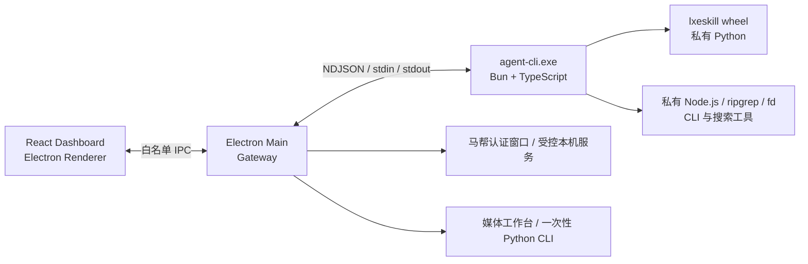

# LXE Agent Desktop 技术手册

本文档说明 `main` 分支桌面产品线的进程边界、运行时、配置、开发与 Windows 打包方式。面向普通使用者的项目介绍见 [项目 README](../../README.md)；独立 TUI 产品线见 [`lxe-agent-TUI`](https://github.com/LXE123/LXE_AGENT/tree/lxe-agent-TUI)。

## 产品边界

- Electron Desktop 是默认产品线，当前正式分发目标为 Windows x64。
- React Dashboard 直接作为 Electron Renderer 加载，不在正式安装包中启动 localhost Dashboard 服务。
- Electron Main 集成 Gateway，并负责窗口、托盘、配置、凭证和后台组件生命周期。
- Agent Runtime 编译为私有 `agent-cli.exe`，其本地 `AgentRuntimeHost` 负责 Store、Provider、Runtime、MCP、Python CLI、Workspace、工具与 Dashboard 生命周期；它不安装系统命令，也不加入系统 `PATH`。同一可执行文件提供显式调用的一次性 `exec` 入口，但 Desktop 仍只使用长驻 `serve`。
- `lxeskill` 保持 Python 原生实现，以 wheel 形式安装到应用携带的私有 Python。
- Dashboard 支持桌面聊天、附件、会话切换、重命名、删除和停止任务；飞书是另一个任务入口。桌面回合还支持结构化问题卡片。

## 运行架构



Electron 自身会创建 Main、Renderer、GPU 和 utility 等多个进程。LXE 额外维护一个常驻 `agent-cli.exe`，并按需启动 Python、浏览器和其他工具子进程。

Renderer 只能访问 preload 暴露的白名单接口。Dashboard 业务请求始终通过类型化 IPC 进入 Main；开发模式仅由 Vite 提供 Renderer 资源，不提供浏览器版业务 Transport。Main 会校验 operation 和结构化 input，Renderer 不能直接访问 Node.js、文件系统或 Shell。

会话数据通过协议事件通知变化，Renderer 再读取类型化查询结果。历史更新、实时展示、会话状态和问题等待各有对应事件与查询；事件不代替状态快照。重新连接、切换会话或界面重建后补取当前状态，详见 [会话状态](session-status.md) 和 [对话窗口](../harness/conversation-window.md)。

AI 调用 `ask_user_question` 后，输入区保留普通聊天草稿并显示问题卡片。回答在卡片内填写，通过专用接口提交；收到确认后恢复普通输入。卡片可停止本次任务，等待期间不增加模型请求。问题归 Bun Runtime 所有，界面刷新可继续回答，Agent 重启使旧问题失效。完整协议与生命周期见 [结构化提问](../harness/tool/ask-user-question.md)。

Main 与 `agent-cli` 使用 NDJSON 协议通信：每行是一个完整 JSON 消息，通过标准输入输出传递初始化、执行回合、取消、关闭、状态和错误事件。两个进程分别拥有自己的 SQLite 数据库，禁止并发写入同一个数据库。Main 内的 Gateway 不依赖 Runtime package；`agent-cli` 也不依赖 Gateway package。

## 私有运行时与工具

Windows 安装包在 ASAR 外携带固定版本的运行资源，包括：

- Node.js 22 与 DingTalk、Lark、Whiteboard CLI。
- Python 3.12.10、生产依赖和当前源码构建的 LXE wheel。
- Playwright 控制库与 Selenium 所需 Python 依赖；马帮桌面认证使用 Electron 窗口，不再附带独立 Chromium。
- ripgrep、fd、ExifTool 与编译后的 `agent-cli.exe`。
- 官方 WireGuard 1.1 x64 MSI、许可证与受控提权配置脚本。

应用只向自己创建的子进程注入私有工具路径，不修改系统 `PATH`。最终安装包保留运行所需的 Node、Python、pip、CLI 和 Electron，但不会携带构建期使用的 npm/npx、npm cache 或 `uv.exe`。

`lxeskill` 在每次桌面构建时从当前源码生成 wheel，并安装进暂存的私有 Python。Runtime 使用以下形式启动模块：

```text
python.exe -I -m lxeskill ...
```

`-I` 启用 Python 导入隔离，避免用户级 Python 配置和 site-packages 污染运行环境；`-m` 按模块启动 `lxeskill`。运行时同时设置 `PYTHONNOUSERSITE=1`。源码模式使用当前 checkout 自己的 `.venv`，不共享其他 worktree 的 editable 安装。这个导入隔离不提供文件系统沙箱。

运行时执行 `lxeskill list` 检查业务 CLI；失败会保留实际诊断，普通 Agent 能力可继续运行。桌面和独立终端的马帮认证入口见 [浏览器认证手册](../../python/lxeskill_cli/browser_auth_service/README.md)。紫鸟页面操作遵守 [官方配对 Selenium 约束](../harness/skill/reference/ziniao-webdriver-doc-1.0.0/reference/automation-framework-policy.md)。

### 工作台媒体标签

Windows 桌面以及 macOS 源码版、预览版的“工作台”提供“亚马逊 AI 人物标签”。第一版图片支持 JPG、JPEG、PNG；视频范围按 [Amazon 商品视频说明](https://sell.amazon.com/blog/amazon-product-video) 收窄为 MP4 和 MOV。工具固定向 XMP `dc:subject` 的 `rdf:Bag` 追加 `contains-synthetic-performer`，再重新读取元数据确认标签写入成功。它不判断画面是否真的包含 AI 人物，也不检查分辨率、时长等其他上传要求。

文件选择和输出目录由 Electron Main 管理，Renderer 只拿到一次性的选择编号和任务编号，不能自己拼磁盘路径。Main 直接启动私有 Python 中的 `lxeskill media synthetic-performer --stdin-json`，Python 再调用 Windows 安装包或 Mac 项目缓存里的私有 ExifTool；这条路线不经过 Agent CLI。原文件始终不修改，输出放进独立的任务文件夹。应用同一时间只运行一个媒体任务，关闭应用时会终止尚未完成的 Python 和 ExifTool 进程。

在 Mac 上运行 `bun run desktop:dev` 或 `bun run desktop:preview` 时，会先检查项目自己的 ExifTool 13.59。首次启动会从官方 SourceForge 下载约 8 MB 的完整 Perl 版本，核对 SHA-256 后，只保留 `exiftool` 和它必须配套的 `lib` 目录。缓存放在 `build/desktop-runtime/darwin-<arch>`，以后启动直接复用，不要求用户通过 Homebrew 或系统安装包安装 ExifTool。需要单独检查或重新准备时，可以运行：

```bash
bun run desktop:tools:mac
```

这项支持只覆盖 Mac 源码开发和生产页面预览；当前仍不生成 DMG，也不代表 Mac 正式发布流水线已经完成。

## 桌面配置与安全

首次启动可接入公司云端，或配置受支持的本地模型 Key，并设置默认工作区。公司通过 v3 发布模型描述，可在客户端支持的供应商和协议内增加模型 ID、上下文及推理参数；供应商、协议与地址由客户端固定规则校验。个人模型仍读取本地目录。发布和兼容规则见 [云端模型描述](../harness/llm/managed-model-catalog.md)，选择和凭据入口见 [Provider Catalog](../harness/llm/provider_catalog.md)。未显式选择工作区时，Desktop 使用数据根下的 `workspace/`；也可选择其他已有且可访问的目录。

公司模型凭证、紫鸟密码、马帮密码、飞书 App Secret 和 Data Server API Key 通过 Electron `safeStorage` 加密写入 `var/config/secrets.bin`。用户自带的本地模型 Key 则从设置页单独填写，以明文 JSON 写入 `var/config/auth.json`，不做应用层加密。POSIX 平台创建配置目录时使用 `0700`，`auth.json` 和锁文件使用 `0600`；Windows 依赖实际配置目录的 NTFS ACL，不能把 POSIX mode 当作 Windows 的同等保证。配置读取接口只返回各提供商“是否已配置”、文件路径和读取错误，不向 Renderer 回显 Key。

`settings.json` 使用版本化 schema，Desktop Main 是唯一写入者；当前版本和可读取的旧格式以 [`config-store/model.ts`](../../apps/desktop/src/main/config-store/model.ts) 为准。写入使用锁文件、临时文件和原子替换；文件被外部修改或处于非法 JSON 状态时，应用拒绝覆盖并要求重新加载。旧 `desktop.json` 首次读取后迁移并保留一份带迁移标记的短期备份。

`auth.json` 与 `settings.json` 都使用锁文件、临时文件和原子替换。非法 JSON 或未确认的外部修改会显示实际错误并拒绝覆盖。本地 Key 的保存、删除与公司模型选择由 Main 协调，详细规则见 [Provider Catalog](../harness/llm/provider_catalog.md)。

旧模型凭据和配置迁移在 Gateway 启动前完成。历史模型 Key 不会从 dotenv 自动导入本地认证文件；应用数据目录中的历史 `.env` 和 `.env.local` 会在迁移时删除。新配置支持的本地提供商以设置页和模型目录为准，旧配置中的提供商选项不能直接照搬。

preload 提供类型化的会话和 Dashboard 请求、文件选择、配置、云端接入、媒体任务、后台状态与重启等受控能力。具体白名单以 [`preload.ts`](../../apps/desktop/src/preload.ts) 及共享协议为准，Renderer 不能自造文件路径或调用任意 Shell。

源码开发与安装版使用同一套配置职责：

| 文件 | 用途 | 是否提交 Git |
| --- | --- | --- |
| `var/config/settings.json` | 模型偏好、集成身份、路径、日志和 Data Server 等非敏感本机设置 | 否 |
| `var/config/auth.json` | 用户自带的本地模型 Key；明文，仅依靠当前用户文件权限保护 | 否 |
| `.env` | 源码开发使用的非模型集成密钥和密码；每次源码启动读取，安装版不读取 | 否 |
| `var/config/secrets.bin` | 公司下发的模型凭证及其他由 `safeStorage` 加密保存的密钥和密码 | 否 |
| `.env.example` | 源码开发 secret 模板 | 是 |

产品默认值由代码负责。LLM catalog 和 MCP defaults 等 Git 文件是产品策略或契约，不是用户运行配置。Skill 可见范围来自服务器验证的设备权限快照，不再由本地 Bot 或用户名单决定。

Data Server 按批同步回合用量统计，由启用状态和可用业务凭据控制。Desktop Main 统一解析配置后注入 Gateway、Agent 和 Python；启动 dev 或 preview 不会从环境变量获得管理员身份。独立身份凭据只留在 Main，子进程仅获得用途受限的业务凭据。详见 [客户端身份与后台登录](../record/20260910-client-identity-v1.md)。本地真实凭证、会话、业务数据和构建日志不属于安装包资源输入。

源码开发中的根目录 `.env` 不是模型配置：Main 每次启动只读取允许的非模型集成 secret，并仅在内存中覆盖 `secrets.bin` 的同名值。因此修改 `.env` 后重启源码 Desktop 即会生效，也不会把明文自动复制到应用数据目录。安装版不读取仓库 dotenv 文件；应用数据目录中的历史 `.env` 和 `.env.local` 会在模型凭证迁移时删除。

### 公司云端设备接入

在云端接入页导入新版加密接入包：v5 用于受管 WireGuard 接入，v4 用于已有手工隧道或更换凭据。身份、权限同步及后台登录以 [客户端身份手册](../record/20260910-client-identity-v1.md) 为准。

Windows 受管接入由 Main 请求 UAC，安装或复用 WireGuard，并建立 `WireGuardTunnel$lxe-agent` 服务。只路由公司私网目标，不接管普通上网流量；切换绑定在失败时恢复旧配置。Apple Silicon Mac 源码开发的服务安装与排障见 [Mac WireGuard 服务](../harness/desktop/macos-wireguard-service.md)。关闭应用不会卸载系统隧道。

## 本地开发

安装固定依赖：

```bash
bun install --frozen-lockfile
uv sync --frozen --all-groups --python 3.12.10
```

启动完整 Electron 开发环境：

```bash
bun run desktop:dev
```

预览构建后的生产 Renderer，同时继续使用源码 Gateway 和 Agent Runtime：

```bash
bun run desktop:preview
```

生产预览不启动 Vite 或本地 Dashboard HTTP Server，页面从 `app://lxe/` 加载。其配置、加密凭据、日志、数据库和 Electron 会话统一写入当前仓库或 worktree 的 `var/`；它不替代 Unpacked 或安装包验收。

四条桌面运行与验证路线按边界逐级增强：

| 命令 | 用途 | 不覆盖的边界 |
| --- | --- | --- |
| `bun run desktop:dev` | Vite 热更新开发 | 生产 Renderer 和打包布局 |
| `bun run desktop:preview` | 生产 Renderer + 源码 Runtime | 私有运行时和打包布局 |
| `bun run desktop:pack:win` | 生成真实 Unpacked 布局 | NSIS 安装、升级、卸载和运行验收 |
| `bun run desktop:dist:win` | 构造 Windows NSIS 发布产物 | 安装后的人工验收 |

开发时按 [AGENTS.md](../../AGENTS.md) 运行受影响模块的定向检查；合并或发布前运行完整源码验证。新 checkout 先准备真实 `find` 测试需要的 fd：

```bash
bun run desktop:tools:fd
bun run verify:source
```

`bun run verify` 和 `bun run verify:platform` 是这个命令的兼容别名，不再构建 wheel、Agent CLI、Dashboard 或 Electron。

macOS 不生成缺少完整私有运行时的伪 DMG。Mac 平台验证会先准备私有 ExifTool，完成源码检查，再用真实的 JPG、PNG、MP4 和 MOV 验证媒体标签；它仍然不是正式安装包验证：

```bash
bun run verify:platform:mac
```

Electron Builder 配置的 schema、资源 scope 的 owner/目标/声明规则，以及 Skill frontmatter、重名和引用规则由源码测试覆盖。正式打包不重复执行这些独立规则检查；electron-builder 在真正组装时自行校验其配置。

## Windows 构建与发布

如果需要从“五类输入”开始了解 Main、Preload、Dashboard、Agent CLI、Python Runtime、electron-builder、NSIS、安装目录和启动链路，见 [Electron 桌面应用：构建、打包、安装与启动](packaging-pipeline.md)。

Windows x64 构建机只需要 PowerShell 和仓库锁定的 Bun。准备或复用受管运行时：

```powershell
bun run desktop:runtime:win
```

日常验证真实打包布局时生成独立的 Unpacked 应用，不执行耗时的 NSIS 压缩：

```powershell
bun run desktop:pack:win
```

可执行文件位于 `dist/desktop-unpacked/win-unpacked/LXE Agent.exe`。该路线执行 wheel、私有 Agent CLI、资源裁剪和体积门禁，但不启动产物，也不验证安装目录选择、快捷方式、升级保留、卸载或 WireGuard 安装器行为。

生成完整 NSIS 安装包：

```powershell
bun run desktop:dist:win
```

在正式发布前先做一次源码验证，再构造一次 NSIS 产物：

```powershell
bun run verify:platform:win
```

两条 Windows 打包路线共用同一包装器：准备或复用可直接发布的运行时，只构建一次当前 wheel overlay、`agent-cli.exe`、Dashboard 与 Electron，再由 electron-builder 从模块各自的生产目录直接组装 `win-unpacked`，不经过统一的大型资源 staging，也不在包装器中提前重复校验 Builder 配置。每个阶段都会输出耗时，正式路线另外生成 NSIS；产物位于 `dist/desktop/`，安装程序命名为 `LXE-Agent-<version>-windows-x64.exe`。版本来自 Git 忽略的 `config/desktop-version.local.json`：Unpacked 复用当前版本，NSIS 成功并完成资源检查后才推进版本；仓库 `package.json` 保持占位版本 `0.1.0`。`verify:platform:win` 先检查平台并准备 fd，再执行一次 `verify:source` 和一次 `desktop:dist:win`。

首次联网构建准备锁定的 Node、Python、uv、ripgrep、fd、ExifTool 和 WireGuard；校验规则以各准备脚本为准。有效缓存可用于离线重建，员工安装和激活阶段无需下载 WireGuard。缓存、wheel overlay、资源裁剪和验收统一见 [打包手册](packaging-pipeline.md)。

## 日志与诊断

全新桌面配置默认使用“标准”日志并保留 7 天；设置页还可选择“关闭”或需要二次确认的“排障”。Dashboard 和 Desktop 设置会把该偏好写入 `settings.json`，不再生成 `.env.local`。

Desktop/Gateway、私有 Agent 和 Python 分别写入 `desktop.log`、`runtime.log` 和 `runtime-py.log`，统一位于项目 `var/logs/runtime/<YYYYMMDD>/`。Provider traces 和飞书诊断也统一放在 `var/logs/`；设置页会显示两个 TypeScript sink 的实际路径与失败原因。日志格式、脱敏和保留策略见 [Logging and runtime traces](../harness/logger.md)。

Windows 安装包把全部受管运行状态和默认工作区放在 `LXE Agent.exe` 同级的 `var/`。升级时安装器原地跳过并保留该目录，即使日志或工作区文件正被其他程序打开，也不会暂存或移动 `var/`；卸载页默认同样保留。只有用户主动勾选“同时删除 LXE Agent 本地运行数据”并再次确认后，才会删除配置、密钥、数据库、日志、登录会话、缓存及 `var/workspace` 内的全部文件，并请求 UAC 清理 `WireGuardTunnel$lxe-agent`。用户明确选择的外部工作区不属于卸载范围。旧 Documents、AppData 或 Application Support 数据不会自动迁移或删除。

桌面设置提供 Gateway、agent-cli 和 lxeskill 健康状态，以及后台组件重启和诊断入口。关闭窗口只隐藏到托盘；从托盘退出 LXE 时，Main 会依次停止 Gateway、Agent 和相关子进程。

## 仓库目录

| 路径 | 内容 |
| --- | --- |
| `apps/desktop` | Electron Main、preload、桌面 IPC 和安装器组装 |
| `apps/agent-cli` | Desktop 私有 NDJSON `serve` 与一次性 `exec` 入口 |
| `apps/gateway` | Gateway、平台接入、调度和 Dashboard API |
| `apps/dashboard` | React Dashboard 与 Electron 桌面外壳 |
| `packages/agent/runtime` | TypeScript Agent Runtime、模型和工具执行 |
| `packages/foundation` | Core、Protocol 与 Desktop Protocol 基础包 |
| `python/lxeskill_cli` | Python 业务命令、浏览器能力和测试 |
| `skills` | Runtime 加载的业务 Skills |
| `config` | 非敏感运行配置和 provider catalog |
| `scripts` | 运行时准备、资源装配、构建和验证脚本 |
| `docs` | 技术手册、有效决策、事故记录和外部参考 |

## 相关文档

- [Electron 桌面应用：构建、打包、安装与启动](packaging-pipeline.md)
- [产品分支与安装入口](../record/20260716-product-lines-branch-migration.md)
- [客户端身份与后台登录](../record/20260910-client-identity-v1.md)
- [Gateway](../harness/gateway/README.md)
- [Agent Runtime](../harness/runtime/README.md)
- [LLM Integration](../harness/llm/README.md)
- [Skill 文档与清单](../harness/skill/README.md)
- [本地数据库布局](../database/local_agent.md)
