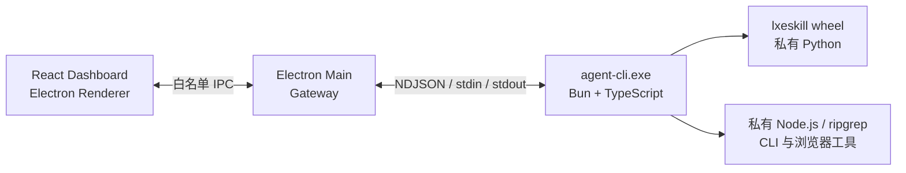

# LXE Agent Desktop 技术手册

Status: Current

本文档说明 `main` 分支桌面产品线的进程边界、运行时、配置、开发与 Windows 打包方式。面向普通使用者的项目介绍见 [项目 README](../../README.md)；源码安装和终端产品线见 [`lxe-agent-TUI`](https://github.com/LXE123/LXE_AGENT/tree/lxe-agent-TUI)。

## 产品边界

- Electron Desktop 是默认产品线，当前正式分发目标为 Windows x64。
- React Dashboard 直接作为 Electron Renderer 加载，不在正式安装包中启动 localhost Dashboard 服务。
- Electron Main 集成 Gateway，并负责窗口、托盘、配置、凭证和后台组件生命周期。
- Agent Runtime 编译为私有 `agent-cli.exe`，其本地 `AgentRuntimeHost` 负责 Store、Provider、Runtime、MCP、Python CLI、Workspace、工具与 Dashboard 生命周期；它不安装系统命令，也不加入系统 `PATH`。
- `lxeskill` 保持 Python 原生实现，以 wheel 形式安装到应用携带的私有 Python。
- 会话交互首版继续通过飞书等渠道完成，Dashboard 只承担管理和查看职责。

## 运行架构



Electron 自身会创建 Main、Renderer、GPU 和 utility 等多个进程。LXE 额外维护一个常驻 `agent-cli.exe`，并按需启动 Python、浏览器和其他工具子进程。

Renderer 只能访问 preload 暴露的白名单接口。Dashboard 业务请求始终通过类型化 IPC 进入 Main；开发模式仅由 Vite 提供 Renderer 资源，不提供浏览器版业务 Transport。Main 会校验 operation 和结构化 input，Renderer 不能直接访问 Node.js、文件系统或 Shell。

Main 与 `agent-cli` 使用 NDJSON 协议通信：每行是一个完整 JSON 消息，通过标准输入输出传递初始化、执行回合、取消、关闭、状态和错误事件。两个进程分别拥有自己的 SQLite 数据库，禁止并发写入同一个数据库。Main 内的 Gateway 不依赖 Runtime package；`agent-cli` 也不依赖 Gateway package。

## 私有运行时与工具

Windows 安装包在 ASAR 外携带经过固定版本和冒烟验证的运行资源，包括：

- Node.js 22 与 DingTalk、Lark、Whiteboard CLI。
- Python 3.12.10、生产依赖和当前源码构建的 LXE wheel。
- Playwright Chromium、Selenium 所需 Python 依赖和浏览器认证能力。
- ripgrep 与编译后的 `agent-cli.exe`。
- 官方 WireGuard 1.1 x64 MSI、许可证与受控提权配置脚本。

应用只向自己创建的子进程注入私有工具路径，不修改系统 `PATH`。最终安装包保留运行所需的 Node、Python、pip、CLI 和浏览器，但不会携带构建期使用的 npm/npx、npm cache 或 `uv.exe`。

`lxeskill` 在每次桌面构建时从当前源码生成 wheel，并安装进暂存的私有 Python。Runtime 使用以下形式启动模块：

```text
python.exe -I -m lxeskill ...
```

`-I` 启用隔离模式，避免用户级 Python 配置和 site-packages 污染运行环境；`-m` 按模块启动 `lxeskill`。运行时同时设置 `PYTHONNOUSERSITE=1`。

## 桌面配置与安全

首次启动向导负责模型凭证和默认工作区，可按需增加紫鸟、马帮、飞书和日志配置。首次启动与后续设置共用同一表单，并可从本机 `.env` 或 `.env.local` 一键导入。选择文件后 Main 只向界面返回检测分组、覆盖范围、待补全字段和警告；用户确认后才提交配置。模型 API Key、紫鸟密码、马帮密码、飞书 App Secret 和 Data Server API Key 通过 Electron `safeStorage` 加密写入 `var/config/secrets.bin`，公开配置写入 `var/config/desktop.json`；配置读取接口只返回“是否已配置”，不会回显明文。

导入使用一次性、十分钟有效的内存草稿，不修改或删除源文件。只导入非空值，空值和未出现的字段保留当前设置；重复变量以第一次出现为准。部分集成会保存为“待补全”，但不会注入运行环境。紫鸟 APP 路径不符合当前平台要求时同样保持停用，用户可在设置中重新选择路径。导入排障日志配置前必须确认其可能包含消息正文、账号标识和页面上下文。

桌面 preload 只暴露以下受控能力：

- Dashboard request transport。
- 工作区选择。
- `.env` 配置文件选择、脱敏预览和一次性应用/取消。
- 公司云端设备文件选择、激活、状态读取和连接重试。
- 紫鸟 APP 与驱动目录选择。
- 日志目录打开。
- 后台健康状态查询。
- Agent 重启。
- Setup 状态读取与保存。
- 状态变化订阅。

源码开发仍使用仓库配置分层：

| 文件 | 用途 | 是否提交 Git |
| --- | --- | --- |
| `config/runtime.env` | 随项目分发的非敏感默认值 | 是 |
| `.env` | 飞书、LLM、马帮、紫鸟等私有配置 | 否 |
| `.env.local` | 本机非敏感覆盖项和 Dashboard 模型设置 | 否 |
| `.env.example` | 私有配置示例 | 是 |
| `.env.local.example` | 本地调试配置示例 | 是 |

Data Server 同步是可选能力，需要显式配置 `LXE_DATA_SERVER_ENABLED`、`LXE_DATA_SERVER_URL` 和 `LXE_DATA_SERVER_API_KEY`。本地真实凭证、会话、业务数据和构建日志不会被资源装配器复制进安装包。

### 公司云端设备接入

Windows 10/11 x64 安装包支持管理员签发的 `.lxe-enroll` 设备文件。员工在首次启动或设置页选择设备文件并输入单独发送的一次性密码；文件路径、WireGuard 私钥和设备上传 Token 只进入 Electron Main，Renderer 仅接收设备名称、设备 ID、VPN IP 和脱敏状态。

Main 使用一次 UAC 授权安装或复用 WireGuard 1.1 及更高版本。配置先由 WireGuard manager service 转换为 Local System 保护的 `.conf.dpapi`，再创建 `WireGuardTunnel$lxe-agent` 开机服务，所有明文临时配置随后删除。隧道只路由 `10.88.0.1/32`，不会接管员工电脑的普通上网流量。

设备上传 Token 通过 `safeStorage` 写入 `secrets.bin`，非敏感设备信息写入 `desktop.json`。正式安装包自动注入私网 Data Server 地址、设备 Token 和 3600 秒同步周期；网络不可用时 Agent 保持运行，并在后续定时同步或用户点击“重试连接”时恢复。源码开发和现有 Mac 手工 WireGuard 配置不受此流程影响。

## 本地开发

安装固定依赖：

```bash
bun install --frozen-lockfile
uv sync --frozen --all-groups --python 3.12.10
```

启动完整 Electron 开发环境：

```bash
bun run desktop:dev
```

预览构建后的生产 Renderer，同时继续使用源码 Gateway 和 Agent Runtime：

```bash
bun run desktop:preview
```

生产预览不启动 Vite 或本地 Dashboard HTTP Server，页面从 `app://lxe/` 加载。其配置、加密凭据、日志、数据库和 Electron 会话统一写入当前仓库或 worktree 的 `var/`；它不替代 Unpacked 或安装包验收。

运行完整源码检查：

```bash
bun run verify
```

macOS 可运行跨平台源码和构建门禁，但不会生成缺少私有运行时的伪 DMG：

```bash
bun run verify:platform:mac
```

完整检查覆盖 TypeScript 生产边界、typecheck、Bun 测试、Python/LXE Skill 测试、wheel、原生 Agent CLI、Dashboard、Gateway、Electron 构建和 Electron Builder 配置校验。

## Windows 构建与发布

Windows x64 构建机只需要 PowerShell 和仓库锁定的 Bun。准备或复用受管运行时：

```powershell
bun run desktop:runtime:win
```

生成完整 NSIS 安装包：

```powershell
bun run desktop:dist:win
```

运行 Windows 完整发布门禁：

```powershell
bun run verify:platform:win
```

构建顺序会先校验 Electron Builder 配置，再准备运行时、构建 wheel 和 `agent-cli.exe`、装配 Dashboard 与私有资源、执行冒烟验证，最后生成 NSIS 并检查体积预算。产物位于 `dist/desktop/`，安装程序命名为 `LXE-Agent-<version>-windows-x64.exe`。

首次联网构建会缓存固定版本的 Node、Python、uv、ripgrep、Playwright Chromium 和 WireGuard 1.1 MSI；WireGuard 资源必须同时通过固定 SHA-256 与 Authenticode 签名校验。后续可使用缓存离线重建，员工安装和激活阶段不会下载 WireGuard。完整的运行时锁定、缓存、资源裁剪、体积基线和平台门禁说明见 [Electron desktop packaging](../record/20260715-electron-desktop-packaging.md)。

## 日志与诊断

全新桌面配置默认使用“标准”日志并保留 7 天；设置页还可选择“关闭”或需要二次确认的“排障”。源码开发也可在 `.env.local` 中设置：

```text
LOCAL_LOGS_ENABLED=1
```

Desktop/Gateway、私有 Agent 和 Python 分别写入 `desktop.log`、`runtime.log` 和 `runtime-py.log`，统一位于项目 `var/logs/runtime/<YYYYMMDD>/`。Provider traces 和飞书诊断也统一放在 `var/logs/`；设置页会显示两个 TypeScript sink 的实际路径与失败原因。日志格式、脱敏和保留策略见 [Logging and runtime traces](../harness/logger.md)。

Windows 安装包把全部受管运行状态放在 `LXE Agent.exe` 同级的 `var/`。升级始终保留该目录；卸载页默认也保留，只有用户主动勾选“同时删除 LXE Agent 本地运行数据”才会删除，并同时请求 UAC 清理 `WireGuardTunnel$lxe-agent`。业务 workspace 和用户技能不属于卸载范围。旧 AppData/Application Support 数据不会自动迁移或删除。

桌面设置提供 Gateway、agent-cli 和 lxeskill 健康状态，以及后台组件重启和诊断入口。关闭窗口只隐藏到托盘；从托盘退出 LXE 时，Main 会依次停止 Gateway、Agent 和相关子进程。

## 仓库目录

| 路径 | 内容 |
| --- | --- |
| `apps/desktop` | Electron Main、preload、桌面 IPC 和安装后冒烟验证 |
| `apps/agent-cli` | 私有 NDJSON Agent CLI |
| `apps/gateway` | Gateway、平台接入、调度和 Dashboard API |
| `apps/dashboard` | React Dashboard 与 Electron 桌面外壳 |
| `packages/agent/runtime` | TypeScript Agent Runtime、模型和工具执行 |
| `packages/foundation` | Core、Protocol 与 Desktop Protocol 基础包 |
| `python/lxeskill_cli` | Python 业务命令、浏览器能力和测试 |
| `skills` | Runtime 加载的业务 Skills |
| `config` | 非敏感运行配置和 provider catalog |
| `scripts` | 运行时准备、资源装配、构建和验证脚本 |
| `docs` | 当前技术文档、设计记录和归档入口 |

## 相关文档

- [产品分支与安装入口](../record/20260716-product-lines-branch-migration.md)
- [LXE Skill CLI Python wheel 运行时](../record/20260715-lxeskill-python-runtime.md)
- [Gateway](../harness/gateway/README.md)
- [Agent Runtime](../harness/runtime/README.md)
- [LLM Integration](../harness/llm/README.md)
- [Skill 文档与清单](../harness/skill/README.md)
- [本地数据库布局](../database/local_agent.md)
