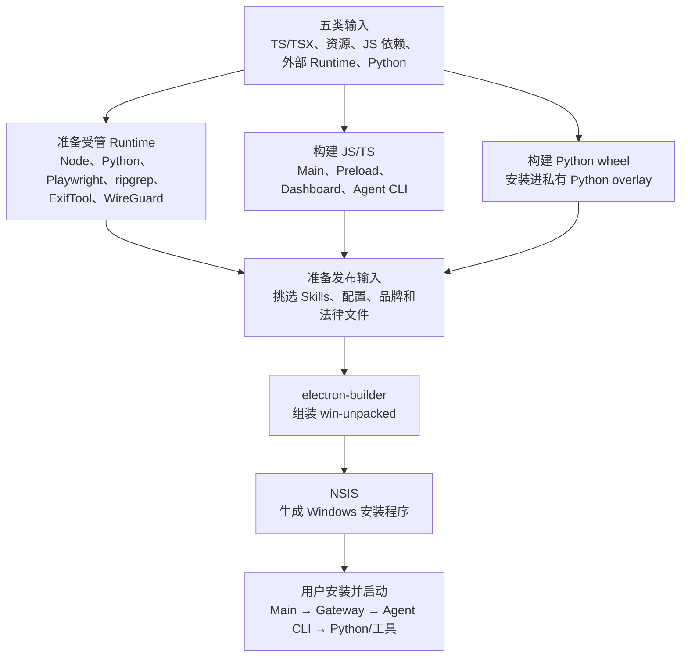
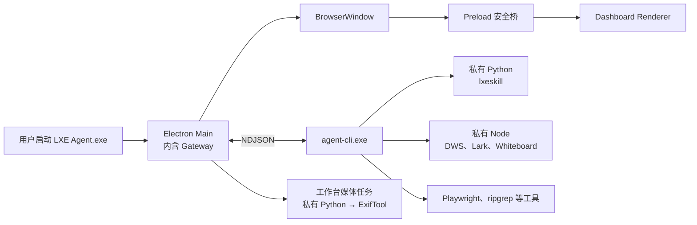

# Electron 桌面应用：构建、打包、安装与启动

Status: Current

这篇文档用大白话说明 LXE Agent Desktop 是怎么从一份源码，变成 Windows 安装程序，再变成一套正在运行的桌面应用。

这里重点讲主流程。具体版本号、资源白名单和脚本实现仍以仓库代码为准。

## 先看常用命令

在仓库根目录运行下面的命令。

| 想做什么 | 命令 | 最终得到什么 |
| --- | --- | --- |
| 开发桌面界面 | `bun run desktop:dev` | Vite 热更新页面和源码运行的 Electron |
| 预览生产版页面 | `bun run desktop:preview` | 生产版 Dashboard，但 Gateway 和 Agent Runtime 仍从源码运行 |
| 只检查源码 | `bun run verify:source` | 类型检查、Bun 测试和 Python 测试结果，不生成安装包 |
| 准备 Windows 私有运行环境 | `bun run desktop:runtime:win` | 可重复使用的 Node、Python、浏览器等受管 Runtime |
| 快速检查真实打包目录 | `bun run desktop:pack:win` | `dist/desktop-unpacked/win-unpacked/LXE Agent.exe` |
| 生成 Windows 安装程序 | `bun run desktop:dist:win` | `dist/desktop/LXE-Agent-<version>-windows-x64.exe` |
| 做一次正式发布验证 | `bun run verify:platform:win` | 先完整检查源码，再生成一次 NSIS 安装程序 |

平时最常用的是三条：

- 改代码时用 `bun run desktop:dev`。
- 想确认真实打包目录时用 `bun run desktop:pack:win`。
- 准备发布时用 `bun run verify:platform:win`。

目前正式打包只支持 **Windows x64**。macOS 只能执行源码验证，不生成正式 DMG。

### 正式打包时选择版本

`desktop:dist:win` 在开始构建前读取 `apps/desktop/package.json`，显示当前桌面产品版本，并给出自动增加修订号后的版本：

```text
Current desktop version: 0.1.0
Automatically bump patch version to 0.1.1? [Y/n]:
```

直接按回车或输入 `y`，就会使用 `0.1.1`。这里的自动升级只增加最后一段，例如 `0.1.9 → 0.1.10`。

输入 `n` 可以手动填写纯数字 `x.y.z`。手动版本可以等于当前版本，方便上一次构建失败后用原版本重试；也可以高于当前版本，但不能降级。

选定的版本会立即写回 `apps/desktop/package.json`，即使后续构建失败也不会自动回退。`desktop:pack:win` 是快速 Unpacked 路线，不会询问或修改版本。`verify:platform:win` 会先完成源码验证，随后进入 `desktop:dist:win` 时再询问版本。

## “构建”“打包”“安装”“启动”不是一回事

这四个词经常被混在一起，其实它们分别解决不同的问题：

1. **构建**：把人写的源码变成机器能直接运行或读取的产物。例如把 TypeScript 变成 JavaScript，把 Python 项目变成 wheel。
2. **组装**：把程序、运行环境、工具和配置放进正确的目录，让它们能互相找到。
3. **打包**：把组装好的应用目录压缩并封装成 Windows 安装程序。
4. **安装和启动**：安装程序把文件释放到用户选择的目录；用户启动应用后，各个进程才真正开始工作。

可以把它想成搬家：先把物品加工好，再按房间装箱，然后把箱子运到新家，最后拆箱开工。

## 打包前有五类输入

LXE Agent 不是只有一个 Electron 页面。它同时包含 TypeScript、Python、浏览器、命令行工具和大量产品资源。不同输入不能用同一种方式处理。

先分清一个容易混淆的地方：V8 负责执行 JavaScript，Chromium 负责解析和显示 HTML、CSS。Electron 把 Chromium、V8 和 Node 组合在一起，但这不代表安装包里的 Python、外部 Node 和其他 EXE 也由 Electron 编译或执行。

### 1. 自己编写的 TypeScript 和 TSX

主要包括四块：

- Electron Main：桌面应用的主进程。
- Electron Preload：Main 和页面之间的安全桥梁。
- Dashboard：用户看到的 React 页面，也就是 Renderer。
- Agent CLI：独立运行的 Agent 后台程序。

前三者最终在 Electron 中运行；Agent CLI 则编译成独立的 `agent-cli.exe`，由 Main 内的 Gateway 启动。

### 2. 产品资源

这类文件分成两种处理方式：Dashboard 使用的 HTML、CSS、图片和字体会先交给 Vite；其余产品文件主要经过白名单挑选后原样带进应用：

- HTML、CSS、图片和字体。
- `SOUL.md` 和各个 Skill。
- JSON、YAML 和环境默认配置。
- Dashboard 构建后的静态文件。
- 图标、许可证和第三方声明。

本机的 `.env`、登录态、数据库、日志和业务文件不会因为放在仓库附近就自动进入安装包。资源准备脚本只选择产品明确允许的文件。

### 3. 第三方 JavaScript 依赖

例如 React、飞书 SDK，以及 workspace packages 中的 TypeScript/JavaScript 代码。

它们通常会跟随自己的使用入口，被 Bun 或 Vite 一起打进对应产物。这样安装后的应用不需要回到源码仓库找这些依赖。

### 4. 外部 Runtime 和工具

这些本来就是可以直接运行的程序，不应该再交给 Bun 或 Vite 编译：

- 私有 Node.js。
- 私有 Python。
- Playwright Chromium。
- ripgrep。
- ExifTool，用来读取和写入图片、视频元数据。
- WireGuard 安装包和受控配置脚本。
- 安装在私有 Node 中的 DWS、Lark 和 Whiteboard CLI。

这里的“私有”是指它们跟着 LXE Agent 一起分发，只供 LXE Agent 的子进程使用，不依赖用户电脑是否提前安装，也不会修改系统 `PATH`。

需要特别区分两套 Node：

- Electron 自带的 Node 和 Chromium，用来运行 Electron Main、Preload 和页面。
- `resources/runtime/node` 中的私有 Node，用来运行 DWS、Lark、Whiteboard 等命令行工具。

### 5. Python 项目代码

主要是 LXE Skill CLI，也就是 `lxeskill`，以及它需要的 Python 依赖。

Python 代码不能交给 V8 运行，所以它走自己的构建路线：先用 `uv build` 生成 wheel，再把 wheel 安装进应用携带的私有 Python。安装后 Agent 可以直接调用：

```text
python.exe -I -m lxeskill ...
```

这样不需要用户安装 Python，也不需要临时修改 Python 的查找路径。

## 整条流水线



实际脚本会按下面的顺序执行。

## 第一步：准备受管 Runtime

Windows 打包首先准备应用自带的运行环境，包括 Node、Python、Playwright Chromium、ripgrep 和 ExifTool。WireGuard MSI 也会在这个阶段单独准备。

第一次联网构建需要下载这些固定版本的文件。准备完成后会保存在本地缓存中，后续构建可以直接复用，避免每次都重新下载几百 MiB 的 Runtime。

这一步只是在准备“底座”，还没有把当前 LXE 项目代码装进去。这样修改一行业务代码时，不需要重新复制整套 Python 和浏览器。

对应命令是：

```powershell
bun run desktop:runtime:win
```

日常执行 `desktop:pack:win` 或 `desktop:dist:win` 时，公共打包脚本也会自动准备或复用这套 Runtime，一般不需要提前单独运行。

## 第二步：构建当前项目代码

### Electron Main：Bun build

Main 是桌面应用的“大脑”，权限最高。它负责：

- 创建窗口和托盘。
- 读取本地配置、数据库和日志目录。
- 在同一个进程中启动 Gateway。
- 启动和管理 `agent-cli.exe`。
- 管理应用启动、退出和后台生命周期。

Main 源码从 `apps/desktop/src/main.ts` 出发，通过 Bun 构建成：

```text
apps/desktop/dist/main.js
```

### Electron Preload：Bun build

Preload 是 Main 和 Dashboard 之间的安全桥梁。它只向页面开放经过允许的 API，Dashboard 不能直接访问 Node、文件系统或 Shell。

它通过 Bun 构建成 CommonJS 文件：

```text
apps/desktop/dist/preload.cjs
```

Main 和 Preload 必须分开构建，因为它们处在 Electron 的不同安全区域，运行方式也不同。

### Dashboard：Vite build

Dashboard 是用户直接看到的 React 页面。Vite 从页面入口出发，处理 TSX、HTML、CSS、图片和字体，并把第三方前端依赖一起整理成生产静态文件：

```text
apps/dashboard/dist/
```

安装后不再启动 Vite，也不再启动本地 Dashboard HTTP Server。Electron 通过 `app://lxe/` 直接加载这些静态文件。

### Agent CLI：Bun compile

Agent CLI 也是 TypeScript 编写的，但它不是 Electron 页面的一部分。Bun 把它和运行所需的代码、Bun Runtime 一起编译成一个独立程序：

```text
dist/agent-cli/agent-cli.exe
```

应用启动后，Gateway 会把它作为子进程启动，并通过标准输入输出传递一行一个 JSON 的 NDJSON 消息。

### LXE Skill CLI：uv build

打包脚本会从当前源码构建 LXE 项目 wheel，并把其中的 `lxeskill` 安装到一个很小的 Python overlay：

```text
build/desktop-publish/python-site-packages/
```

electron-builder 组装时，再把这个 overlay 合并到私有 Python 的 `Lib/site-packages`。因此每次打包都会带上当前 Python 源码，同时可以复用那套很大的基础 Python Runtime。

## 第三步：准备发布资源

这一步不再编译业务代码，主要做两件事：

1. 检查 Main、Preload、Dashboard、Agent CLI、wheel 和各个 Runtime 是否已经存在。
2. 根据产品资源范围，生成一份给 electron-builder 使用的配置。

资源采用白名单选择。要放进安装包的 Skill、配置、品牌图片和法律文件都会明确列出；本机凭证、会话、日志、缓存和业务数据不是输入。

生成的临时配置位于：

```text
build/desktop-publish/electron-builder.json
```

它在基础 `apps/desktop/electron-builder.yml` 上补充当前构建真正要复制的 `extraResources`。

## 第四步：electron-builder 组装应用目录

electron-builder 把前面准备好的产物组装成一个完整的 Windows 应用目录。这里最重要的是分清 `app.asar` 和 `extraResources`。

### app.asar 放 Electron 自己的核心代码

当前主要包含：

```text
main.js
preload.cjs
```

`app.asar` 是 Electron 常用的应用代码归档。它适合放 Main 和 Preload，但不适合放需要直接作为外部程序启动的大型 Runtime 和 EXE。

### extraResources 放运行时和产品资源

主要目录如下：

```text
resources/
├── app.asar
├── dashboard/
├── runtime/
│   ├── agent-cli/agent-cli.exe
│   ├── node/
│   ├── python/
│   ├── playwright/
│   └── tools/
│       ├── rg.exe
│       └── exiftool/
│           ├── exiftool.exe
│           └── exiftool_files/
├── wireguard/
├── agent/SOUL.md
├── skills/
├── lxeskill/catalog.json
├── config/
├── branding/
└── legal/
```

Dashboard 放在 `resources/dashboard`，因为 Main 要通过 `app://lxe/` 按文件加载页面。Agent CLI、Python、Node 和其他工具放在 ASAR 外，是因为操作系统或子进程需要直接访问和执行它们。

完成后得到：

```text
dist/desktop-unpacked/win-unpacked/
```

或者正式路线中的：

```text
dist/desktop/win-unpacked/
```

这个目录已经是一套完整、可运行的 Electron 应用。Electron 自带的 Chromium、Node、DLL 和 `LXE Agent.exe` 也由 electron-builder 放在这里。

## 第五步：NSIS 生成安装程序

`desktop:pack:win` 到 `win-unpacked` 就停止，适合快速检查真实目录结构，不花时间生成安装程序。

`desktop:dist:win` 会继续调用 NSIS：

```text
win-unpacked
    → ZIP 应用载荷
    → NSIS 安装/升级/卸载逻辑
    → LXE-Agent-<version>-windows-x64.exe
```

安装程序允许用户选择安装目录，并创建桌面和开始菜单快捷方式。升级时会替换程序文件，但保留安装目录中的 `var` 数据目录。卸载时也默认保留数据，只有用户明确勾选并再次确认后才删除。

WireGuard MSI 虽然已经放进安装包，但普通安装过程不会直接安装 WireGuard。只有用户配置公司云端设备时，应用才按需请求 UAC 权限并执行受控安装和隧道配置。

## 安装之后是什么样

可以把安装目录粗略理解成下面这样：

```text
LXE Agent/
├── LXE Agent.exe
├── Electron、Chromium 和 DLL
├── resources/
│   ├── app.asar
│   ├── dashboard/
│   ├── runtime/
│   ├── skills/
│   ├── config/
│   └── ...
└── var/                    # 首次运行后创建
    ├── config/
    ├── db/
    ├── logs/
    ├── tmp/
    └── workspace/
```

`resources` 是随版本发布的程序和只读资源；`var` 是这台电脑上运行后产生的配置、数据库、日志和默认工作区。升级程序时保留 `var`，就是为了避免升级后丢失用户状态。

## 用户启动应用后发生什么

用户双击 `LXE Agent.exe` 后，主链路是：

1. Electron Runtime 启动，并从 `app.asar` 加载 `main.js`。
2. Main 确定 `resources` 和 `var` 路径，初始化配置、日志、数据库和单实例锁。
3. 配置完成后，Main 在自己的进程里启动 Gateway。
4. Gateway 启动 `resources/runtime/agent-cli/agent-cli.exe` 子进程，通过 NDJSON 与它通信。
5. Agent CLI 按任务需要调用私有 Python、`lxeskill`、Node CLI、ripgrep 或 Playwright Chromium；桌面工作台的媒体任务则由 Main 直接启动私有 Python 和 ExifTool，不绕经 Agent CLI。
6. Main 创建 BrowserWindow，通过 Preload 暴露的白名单 IPC，让 Dashboard 与 Main、Gateway 和 Agent 交互。



关闭窗口只会把应用隐藏到托盘，Gateway 和 Agent 仍可在后台工作。从托盘选择退出后，Main 才会依次停止 Gateway、Agent 和相关子进程。

## 两条打包路线怎么选

### `desktop:pack:win`：检查真实目录

这条路线会构建当前 wheel、Agent CLI、Dashboard 和 Electron，准备全部资源，生成真实 `win-unpacked`，并执行体积门禁。

它适合日常确认：

- 有没有漏带文件。
- 目录是否符合真实安装后的布局。
- Runtime 和整个应用是否超过体积预算。

它不会自动启动产物，也不会验证安装目录、快捷方式、升级、卸载和 WireGuard UAC 行为。

### `desktop:dist:win`：生成安装程序

这条路线包含前面的完整组装，并继续生成 NSIS 安装程序。它适合制作交给测试人员或用户安装的产物。

它本身不先执行全部源码测试。正式发布时应使用：

```powershell
bun run verify:platform:win
```

这个命令固定执行一次 `verify:source`，再执行一次 `desktop:dist:win`，避免同一批生产代码重复构建。

## 当前自动门禁和人工边界

打包过程会检查关键输入和最终 `LXE Agent.exe` 是否存在，还会生成资源体积报告：

```text
desktop-resource-sizes.json
```

当前预算是：

- 受管 Runtime 不超过 950 MiB。
- 完整 `win-unpacked` 不超过 1.30 GiB。

超过预算会直接打包失败。

当前流水线不会自动启动打包后的应用，也不会自动走完安装、升级和卸载。因此正式发布前，仍需要在 Windows 测试机上人工确认：

- 安装程序能正常打开并选择目录。
- 快捷方式能启动应用。
- 首次配置和 Dashboard 正常。
- Gateway、Agent CLI 和 `lxeskill` 健康状态正常。
- 覆盖升级后 `var` 数据仍然存在。
- 卸载保留数据和主动删除数据两种选择都符合预期。
- 公司云端设备场景下的 WireGuard UAC 和隧道配置正常。
- 工作台能分别处理一张图片和一个视频，输出文件带有目标标签，而且原文件没有变化。

## 一句话总结

LXE Agent 的桌面打包不是简单地把 TypeScript 变成一个 EXE，而是：

> 先分别构建 Electron、Dashboard、Agent CLI 和 Python wheel，再准备私有 Node、Python、浏览器、ExifTool 和其他工具，随后由 electron-builder 组装成可运行目录，最后由 NSIS 封装成 Windows 安装程序。
