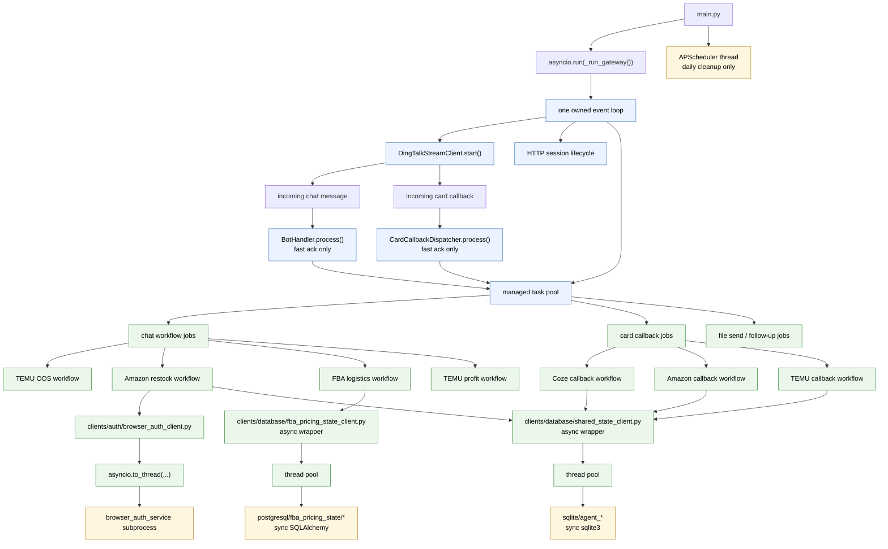

# Event Loop Architecture

This document describes the **current** event-loop model in `robot_coze`.

It is not a design-history file anymore. The old `OLD / NEW / Aggressive` comparison has been removed so this file stays authoritative.

## Runtime Rules

1. `main.py` owns exactly one application event loop.
2. `worker_main.py` / `workers/main.py` owns exactly one worker event loop.
3. DingTalk message entry and card callback entry are both fast-ack only.
4. Heavy business work runs through the managed task pool.
5. Browser auth does not run on the main loop. It is delegated to `browser_auth_service`.
6. Database access stays sync internally, but async callers reach it through client wrappers that offload work to thread pools. Agent shared-state uses SQLite; FBA pricing still uses PostgreSQL.

## Deployment Baseline

- Production baseline is `WSL2/Linux`.
- Windows-native is development/debug only and is not treated as the stable production target.
- Both gateway and worker now use the platform-default asyncio loop:
  - Windows-native: default `ProactorEventLoop`
  - WSL2/Linux: default selector-based event loop
- The worker keeps a Windows-only fatal guard for loop self-pipe failures (`WinError 121` / `10054`). On Linux/WSL2 that guard is a no-op.

## Current Structure


# Event Loop Error Report

## Summary

During runtime on Windows with Python 3.14, the project has shown repeated event-loop internal errors while the business workflows themselves can still continue running normally. The failures appear inside `asyncio`'s own loop wakeup / self-reading paths rather than inside the project workflow code.

## Observed SelectorEventLoop Error

When the project was forced onto `SelectorEventLoop` on Windows-native, the repeated error was:

```text
Exception in callback BaseSelectorEventLoop._read_from_self()
...
File "...\\asyncio\\selector_events.py", line 132, in _read_from_self
    data = self._ssock.recv(4096)
ConnectionResetError: [WinError 10054] 远程主机强迫关闭了一个现有的连接。
```

Observed characteristics:

- The error is emitted repeatedly and can flood the console.
- DingTalk message handling and other workflows can still continue at the same time.
- Normal application logs become difficult to see because the loop-level exception output dominates the console.
- The failing frame is inside Python stdlib `asyncio.selector_events`, not in the project's workflow modules.
- A later observation showed this error on the gateway while the worker did not show the same error under the same session window, but that was not a same-loop comparison: the gateway entrypoint was forcing `SelectorEventLoop`, while the worker entrypoint was still using the default Windows loop.

## Observed ProactorEventLoop Error

When the project runs with the default Windows loop (`ProactorEventLoop`), the repeated error is:

```text
Error on reading from the event loop self pipe
loop: <ProactorEventLoop running=True closed=False debug=False>
...
File "...\\asyncio\\proactor_events.py", line 794, in _loop_self_reading
    f.result()  # may raise
...
OSError: [WinError 121] 信号灯超时时间已到
```

Observed characteristics:

- The error is also emitted repeatedly and can flood the console.
- Business workflows can still continue running while the error appears.
- The failing frame is inside Python stdlib `asyncio.proactor_events` / `asyncio.windows_events`.

## Shared Pattern

Across both loop implementations, the same high-level pattern has been observed:

- The error occurs inside the event loop's own internal self-read / wakeup path.
- The issue appears at runtime even when project workflows remain functional.
- The same symptom persists regardless of whether the project uses the SDK's native `DingTalkStreamClient.start()` directly or a previously tested repo-owned wrapper.
- The visible failure mode changes with the loop implementation, but both variants originate from `asyncio` internals on Windows.

## Current Policy

- Do not force loop type in entrypoint code.
- Let `asyncio` pick the platform default loop.
- Keep Windows-specific mitigation local to the worker fatal guard instead of changing the loop implementation globally.

## Runtime Effect

The practical runtime effect observed so far is:

- workflows may still execute successfully
- DingTalk messages may still be received and processed
- console output becomes dominated by loop-internal exception traces
- expected application logs may appear missing because they are buried by the repeated event-loop error output
