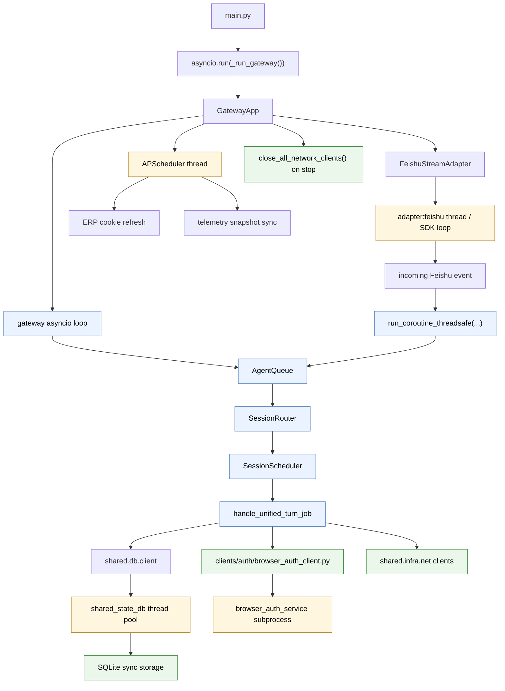

# Event Loop Architecture

This document describes the current event-loop model for `lxe-agent`.

## Runtime Rules

1. `main.py` owns the gateway process event loop with `asyncio.run(_run_gateway())`.
2. The gateway does not start a separate worker process. Agent turns run as asyncio tasks scheduled by `SessionScheduler` on the gateway loop.
3. Feishu SDK work is isolated in `FeishuStreamAdapter`'s `adapter:feishu` thread. Inbound events are posted back to the gateway loop with `asyncio.run_coroutine_threadsafe(...)`.
4. Browser authentication is delegated to the `browser_auth_service` subprocess and is called from synchronous client code off the gateway loop.
5. SQLite access stays synchronous internally. Async callers use `shared.db.client`, which offloads calls to a small thread pool.
6. The process does not force a custom event-loop policy; it uses the platform default loop under Python 3.12.10.

## Current Structure

## Inbound Flow

Feishu inbound messages are accepted by the adapter thread, converted into `InboundEvent`, then published into `AgentQueue` on the gateway loop. The dispatcher drains the queue and asks `SessionRouter` to resolve or create the agent session before enqueueing an `AgentJob`.

`SessionScheduler` keeps one active run per session while allowing different sessions to run concurrently up to `AGENT_MAX_CONCURRENCY`. Stop requests set both asyncio and thread cancellation flags on the active `RunHandle`.

## Background Wake Flow

Long-running tool or process notifications write completed events into `agent_session_pending_events` and request a heartbeat wake. `HeartbeatWakeManager` deduplicates wake requests, checks that pending events still exist, and only enqueues heartbeat jobs when the session is idle. Busy sessions are deferred and retried.

## Shutdown Policy

Gateway shutdown stops heartbeat wake, session scheduler, dispatcher task, channel adapters, APScheduler, network clients, and the SQLite client wrapper in order. APScheduler jobs are limited to independent background maintenance, so adapter startup and shutdown stay owned by the gateway event loop.

## Event Loop Policy

Do not force `SelectorEventLoop` or `ProactorEventLoop` in project entrypoints. Let Python 3.12.10 choose the platform default. Historical Windows self-pipe errors should be investigated from logs, not handled by changing the global loop policy.
