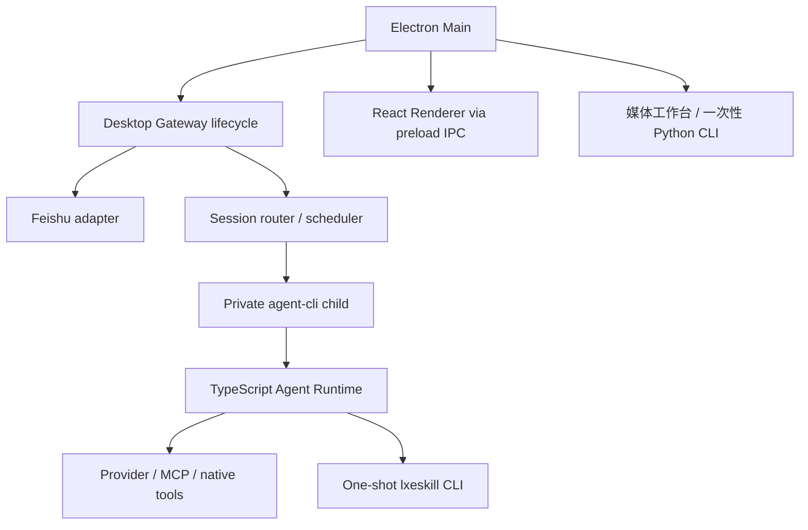

# Desktop Event Loop Architecture

生产环境由 Electron Main 承载桌面 Gateway，由一个私有 `agent-cli` 子进程承载 TypeScript Agent Runtime。Renderer 只通过 preload IPC 与 Electron Main 通信；产品不监听 Dashboard HTTP 端口。

## Runtime Rules

1. `apps/desktop/src/main.ts` 是 macOS/Windows 唯一产品入口。
2. Electron Main 直接装配 Gateway 的 channel、router、scheduler 和 lifecycle。
3. Gateway 通过版本化 JSON-RPC / NDJSON 管理私有 `agent-cli serve` 子进程；同一程序的独立终端入口见 [Agent CLI exec](harness/runtime/agent_cli_exec.md)。
4. 同一 session 串行执行，不同 session 没有全局并发数量门槛；Runtime 必须 ready 才能调度。
5. turn 取消会中止模型请求、MCP 调用、问题等待和当前 exec/wait 观察。已创建的 exec 属于 Session，继续运行；显式 terminate、删除 Session 或关闭 Runtime 才终止进程树。
6. 模型通过 native exec 启动独立 `lxeskill ...` 命令；桌面媒体工作台则由 Main 直接启动一次性 Python CLI。
7. 桌面结构化问题由 Runtime 管理；答案通过专用调用恢复工具等待，不进入普通消息或 steering 队列。等待不发起模型请求，也不阻塞其他 session。

## Current Structure

```mermaid
flowchart TD
    A["Electron Main"] --> B["Desktop Gateway lifecycle"]
    A --> C["React Renderer via preload IPC"]
    A --> J["媒体工作台 / 一次性 Python CLI"]
    B --> D["Feishu adapter"]
    B --> E["Session router / scheduler"]
    E --> F["Private agent-cli child"]
    F --> G["TypeScript Agent Runtime"]
    G --> H["Provider / MCP / native tools"]
    G --> I["One-shot lxeskill CLI"]
```

## Shutdown Policy

关闭顺序为：停止 ingress 和 channel、停止 heartbeat、取消并等待 turn、停止 Runtime 子进程，再关闭桌面持有的存储。Main 同时负责关闭媒体任务、认证窗口及其宿主服务。连续启动和停止不得遗留 SQLite lock、定时器或工具子进程。生产环境没有 Dashboard HTTP listener；马帮认证使用的受控本机服务是另一条链路，见 [浏览器认证](../python/lxeskill_cli/browser_auth_service/README.md)。
