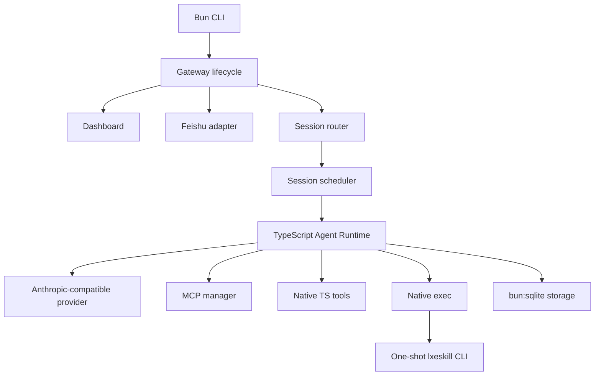

# Event Loop Architecture

生产环境由一个 Bun `1.3.14` 进程承载 Gateway、Runtime、Dashboard、飞书通道和定时维护任务。

## Runtime Rules

1. `apps/gateway/src/main.ts` 是唯一生产入口。
2. `SessionScheduler` 直接调用同进程 `TypeScriptAgentRuntime.runTurn()`，不存在 worker 子进程或 NDJSON envelope。
3. 同一 session 串行执行，不同 session 按 `AGENT_MAX_CONCURRENCY` 并发。
4. turn 的 `AbortSignal` 统一传递给 LLM、MCP 和工具进程；停止时先关闭 ingress，再取消并等待活跃 turn。
5. SQLite 通过 `bun:sqlite` 在同进程内访问，保留既有数据库、JSONL 和 `sessions.json` 格式。
6. Python 业务能力仅由 native `exec` 启动独立的 `lxeskill ...` 命令；catalog、skill scope 和 CLI 共同校验入口，命令完成后进程退出。

## Current Structure

```mermaid
flowchart TD
    A["Bun CLI"] --> B["Gateway lifecycle"]
    B --> C["Dashboard"]
    B --> D["Feishu adapter"]
    B --> E["Session router"]
    E --> F["Session scheduler"]
    F --> G["TypeScript Agent Runtime"]
    G --> H["Anthropic-compatible provider"]
    G --> I["MCP manager"]
    G --> J["Native TS tools"]
    G --> K["Native exec"]
    K --> M["One-shot lxeskill CLI"]
    G --> L["bun:sqlite storage"]
```

## Shutdown Policy

关闭顺序为：停止 ingress、取消并等待 turn、停止 heartbeat/维护任务、停止飞书和 Dashboard、关闭 Runtime 服务并清理 status files。连续启动和停止不得遗留端口、SQLite lock、定时器或子进程。
