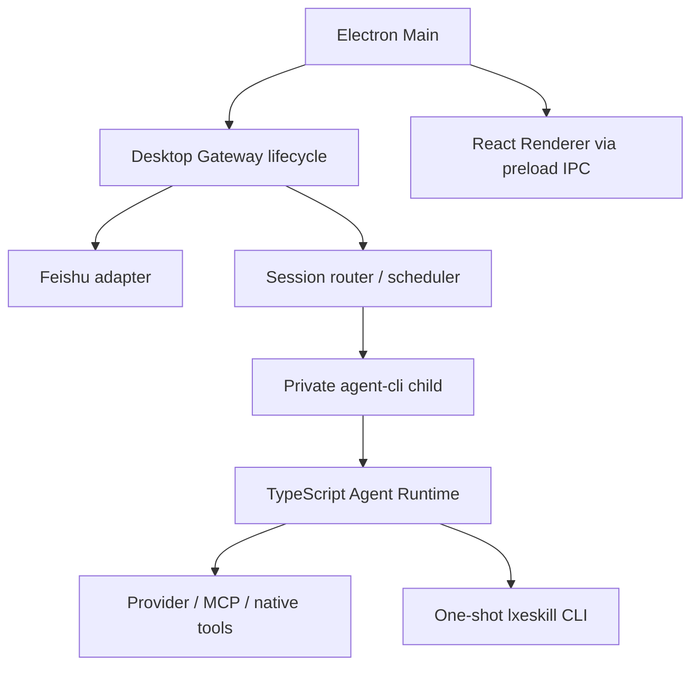

# Desktop Event Loop Architecture

生产环境由 Electron Main 承载桌面 Gateway，由一个私有 `agent-cli` 子进程承载 TypeScript Agent Runtime。Renderer 只通过 preload IPC 与 Electron Main 通信；产品不监听 Dashboard HTTP 端口。

## Runtime Rules

1. `apps/desktop/src/main.ts` 是 macOS/Windows 唯一产品入口。
2. Electron Main 直接装配 Gateway 的 channel、router、scheduler 和 lifecycle。
3. Gateway 通过版本化 NDJSON 协议管理私有 `agent-cli` 子进程，用户不能单独启动该进程作为产品。
4. 同一 session 串行执行，不同 session 按 `AGENT_MAX_CONCURRENCY` 并发。
5. turn 的取消统一传递给 Runtime、LLM、MCP 和工具进程；停止桌面应用时先关闭 ingress，再清理活跃任务和子进程。
6. Python 业务能力仅由 `agent-cli` 的 native exec 启动独立 `lxeskill ...` 命令，命令完成后退出。

## Current Structure

```mermaid
flowchart TD
    A["Electron Main"] --> B["Desktop Gateway lifecycle"]
    A --> C["React Renderer via preload IPC"]
    B --> D["Feishu adapter"]
    B --> E["Session router / scheduler"]
    E --> F["Private agent-cli child"]
    F --> G["TypeScript Agent Runtime"]
    G --> H["Provider / MCP / native tools"]
    G --> I["One-shot lxeskill CLI"]
```

## Shutdown Policy

关闭顺序为：停止 ingress 和 channel、停止 heartbeat、取消并等待 turn、停止 Runtime 子进程，再关闭桌面持有的存储。连续启动和停止不得遗留 SQLite lock、定时器或子进程。不存在需要清理的 Dashboard HTTP listener、浏览器进程或 Gateway CLI 状态文件。
