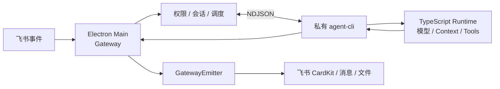

# Gateway

状态：Current

## 先说结论

Gateway 是桌面应用里的“接待和调度中心”。它运行在 Electron Main 中，负责接收飞书消息、检查权限、找到会话、安排执行顺序，再把结果送回正确的聊天窗口。

真正调用模型和工具的是私有 `agent-cli` 子进程里的 Runtime。Gateway 不直接执行 turn，而是通过版本化 NDJSON 协议向子进程发任务、取消和查询请求。

## 当前主链路

Dashboard 也不直接连接 Runtime。Renderer 先通过白名单 IPC 发送类型化 `{ operation, input }` 调用；需要 Agent 数据时，Main 再通过同一套私有协议调用 `agent-cli`，不模拟 HTTP 请求或响应。

## 谁负责什么

| 组件 | 主要职责 | 不负责 |
| --- | --- | --- |
| Electron Main | 管理桌面生命周期、配置、凭证和子进程 | 不执行模型 turn |
| Gateway | 平台接入、权限、session binding、排队、取消和结果路由 | 不调用模型或业务工具 |
| `agent-cli` | 承载 Runtime、Agent 数据库和 Dashboard Agent API | 不接收平台 webhook |
| Runtime | Context、模型调用、工具、transcript 和 usage | 不持有平台 SDK，不决定消息发到哪里 |
| GatewayEmitter | 根据 response route 发送 stream、文件和最终结果 | 不改变 Runtime 已完成的业务结果 |

这种拆分最重要的好处是：平台接入和模型执行互不越界。Runtime 崩溃或重启时，Electron Main 仍能报告健康状态；平台发送失败时，也不会让已经执行成功的工具重新运行。

## 调度与失败边界

- Router 在创建任务前完成权限、session source 和 response route 校验。
- Scheduler 保证同一个 session 串行执行，不同 session 可以并发。
- `/stop`、steering 和桌面退出共用同一条取消链，最终传到 provider、MCP 和工具进程。
- Runtime 子进程短暂异常时，Gateway 停止接收新任务并按受控策略重启；不会偷偷切换到同进程 Runtime。
- 平台发送失败只影响 delivery，不回滚 transcript，也不重跑已完成工具。
- 后台命令结束后先写 pending event，再通过 heartbeat 回到正常调度链。

## 专题导航

- [Gateway Lifecycle](gateway_lifecycle.md)：启动、停止、健康状态和失败回滚。
- [Channel Adapter Boundary](channel_adapter_boundary.md)：平台 adapter 的输入输出边界。
- [Session Routing and Permission](session_routing_permission.md)：权限、会话和控制命令。
- [Session Scheduler and Cancellation](session_scheduler_cancellation.md)：排队、并发、取消和 steering。
- [Emitter and Heartbeat Wake](emitter_heartbeat_wake.md)：统一出站与后台事件唤醒。
- [Desktop Event Loop](../../eventloop.md)：整个桌面产品的进程与关闭顺序。

## 事实来源

实现入口是 [Desktop Gateway](/apps/desktop/src/main/desktop-gateway.ts)、[Gateway orchestration](/apps/gateway/src/orchestration) 和 [Process Runtime port](/apps/gateway/src/orchestration/process-runtime.ts)。测试是失败语义和生命周期的可执行合同；文档与测试不一致时，以当前代码和测试为准。
