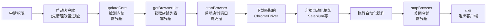

# Ziniao WebDriver Doc

状态：Reference

本文是外部平台/API 参考资料，不是当前运行时 skill 文档。当前 truth source 是 `/skills/*/SKILL.md`。

---

## When to Use

| 场景 | 做法 |
|------|------|
| 需要理解紫鸟 WebDriver 是什么、能做什么 | 读本 skill |
| 需要做自动化集成、框架选型或实现评估 | 读本 skill |
| 需要查某个接口的请求/响应格式 | 先读本 skill，再按需读 `references/` |
| 需要执行具体自动化脚本编写 | 本 skill 只负责解释和索引，具体实现再按需读 `references/` |

## How to Execute

先把定位与边界讲清楚，再按需下钻到 `references/`。

### 是什么

紫鸟浏览器 WebDriver 是紫鸟浏览器提供的本地自动化控制接口。通过命令行参数启动紫鸟浏览器进入 WebDriver 模式后，浏览器会在本地开启 HTTP 服务；开发者可以调用 JSON API 管理店铺窗口，再用 Selenium / Puppeteer / Playwright / DrissionPage 等框架连接调试端口，控制店铺浏览器。

### 能力概览

| 能力域 | 说明 |
|--------|------|
| 客户端启动控制 | 命令行参数启动/退出紫鸟浏览器进入 WebDriver 模式 |
| 认证与登录 | 通过 API 完成设备授权、账号登录、获取店铺列表 |
| 店铺窗口管理 | 启动/关闭指定店铺窗口，获取 `debuggingPort` |
| 自动化框架对接 | 返回调试端口供 Selenium / Puppeteer / Playwright / DrissionPage 连接 |
| 内核管理 | 检测、下载、更新浏览器内核 |
| 缓存与会话 | 清理本地/在线缓存，管理 Cookie 策略 |
| 插件管理 | 启动店铺时加载指定插件、查询插件安装状态 |

### 不做什么

- 不是通用浏览器自动化方案，只适用于紫鸟浏览器客户端。
- 不提供 WebDriver 驱动本身，仍需按 `core_version` 匹配 ChromeDriver。
- 不处理电商平台业务逻辑，只提供浏览器窗口控制能力。
- 默认不是云端部署方案，仅支持本地运行；通过 `--listen_ip` 可放开远程控制。

### 流程全景



### 核心概念

- **WebDriver 模式**：通过 `--run_type=web_driver` 启动紫鸟，进入自动化控制模式。启动前必须关闭紫鸟主进程。
- **HTTP IPC 通信**：所有 API 均为 POST 请求，JSON 格式，UTF-8 编码。地址通常为 `http://127.0.0.1:{port}`。
- **店铺窗口（browserOauth / browserId）**：先 `getBrowserList` 取店铺列表，再 `startBrowser` 启动目标店铺，拿到 `debuggingPort`。
- **内核版本匹配**：必须根据 `startBrowser` 返回的 `core_version` 大版本号匹配 ChromeDriver，不能按系统 Chrome 版本猜。

### 能力摘要表

| 接口 Action | 职责 | 关键输入 | 关键输出 | 需凭据 |
|-------------|------|---------|---------|:------:|
| `updateCore` | 检测/下载内核 | `company, username, password` | `statusCode`, `msg` | 是 |
| `applyAuth` | 设备授权 | `company, username, password` | `statusCode` | 是 |
| `getBrowserList` | 获取店铺列表 | `company, username, password` | `browserList[]` | 是 |
| `startBrowser` | 启动店铺窗口 | `company, username, password, browserOauth/browserId` | `debuggingPort`, `core_version`, `core_type` | 是 |
| `stopBrowser` | 关闭店铺窗口 | `company, username, password, browserOauth/browserId` | `statusCode` | 是 |
| `logout` | 退出登录 | 无 | `statusCode` | 否 |
| `exit` | 退出客户端进程 | 无 | `statusCode` | 否 |
| `ClearCache` | 清理本地缓存 | `browserOauths[]` | `statusCode` | 否 |
| `ClearOnline` | 清理在线缓存 | `company, username, password, browserOauth, type` | `statusCode` | 是 |
| `getPluginInstalled` | 查询插件安装状态 | `browserId, pluginIds` | `install_status` | 否 |
| `getRunningInfo` | 获取已开启的店铺 | 无 | `browsers[]` | 否 |

### 高频陷阱

1. 所有需要凭据的接口，每次调用都必须携带完整 `company/username/password`。
2. 出错时优先读 `err` 字段，而不是只看 `statusCode`。
3. HTTP 响应必须按 UTF-8 解码，否则中文错误信息会乱码。
4. 紫鸟启动失败或异常退出后，必须清理残留进程再重试。
5. ChromeDriver 版本必须按 `core_version` 匹配，不能按系统 Chrome 版本匹配。

### 环境约定

| 项目 | 要求 |
|------|------|
| Windows | 紫鸟 V5 或 V6 (6.16.0.126+) |
| macOS | 紫鸟 V6 (6.15.0.44+) |
| Linux | 紫鸟 V6 (6.25.3.3+) |
| 通信协议 | HTTP POST, JSON, UTF-8 |
| 超时设置 | 至少 120 秒 |
| 启动前提 | 紫鸟主进程必须已完全关闭 |
| 推荐框架 | Selenium（Playwright/Puppeteer 可能被检测为自动化） |

按需深入（Level 2 路由表）：

> 以下内容不要主动加载。仅在明确需要了解某个细节时，再读对应的 `references/` 文件。

| 你需要了解 | 读取文件 |
|-----------|---------|
| 核心工作流接口（applyAuth/getBrowserList/startBrowser） | `references/api-core.md` |
| 辅助管理接口（stopBrowser/logout/exit/缓存/插件/updateCore） | `references/api-auxiliary.md` |
| 启动客户端的命令行参数详细说明 | `references/startup-params.md` |
| 权限开通、账号配置、常见问题排查 | `references/prerequisites.md` |

---

查看店铺列表 - get_browser_list()：
```py
python -c "from services.browser.store.ziniao_client import ZiniaoClient; from services.browser.store import ziniao_config as ziniao_settings; import json; client = ZiniaoClient(int(ziniao_settings.ZINIAO_SOCKET_PORT), {'company': str(ziniao_settings.ZINIAO_COMPANY or '').strip(), 'username': str(ziniao_settings.ZINIAO_USERNAME or '').strip(), 'password': str(ziniao_settings.ZINIAO_PASSWORD or '').strip()}); print(json.dumps(client.get_browser_list(), ensure_ascii=False, indent=2))"
```
获取当前店铺运行信息 - get_running_info()：
```py
python -c "from services.browser.store.ziniao_client import ZiniaoClient; from services.browser.store import ziniao_config as ziniao_settings; from pathlib import Path; import json; client = ZiniaoClient(int(ziniao_settings.ZINIAO_SOCKET_PORT), {'company': str(ziniao_settings.ZINIAO_COMPANY or '').strip(), 'username': str(ziniao_settings.ZINIAO_USERNAME or '').strip(), 'password': str(ziniao_settings.ZINIAO_PASSWORD or '').strip()}); Path('running_info.json').write_text(json.dumps(client.get_running_info(), ensure_ascii=False, indent=2), encoding='utf-8')")"
```


**`getRunningInfo` 响应结果：**

```json
{
  "browserOauth": "浏览器/店铺标识，但在当前环境里字段语义不稳定，可能变成数字 ID，无实用价值",
  "browserName": "店铺名称",
  "browserIp": "按字段名应为浏览器 IP，但在当前环境里可能不是实际 IP，无实用价值",
  "siteId": "站点 ID",
  "isExpired":  false, //ip是否过期
  "proxyType": "代理类型",
  "isDynamic": "是否动态代理",
  "tags": "标签，当前环境里可能是字符串而不是数组",
  "platform_id": "平台 ID",
  "platform_name": "平台名称"
}
```

**说明：**
- 当前样本里 `browserOauth`、`browserIp`、`tags` 的字段语义不可靠
- 不能把这个接口当成 Selenium 连接信息来源
- 当前没有看到：
  - `debuggingPort`
  - `browserPath`
  - `downloadPath`

---

**`getBrowserList` 响应结果：**

```json
{
  "browserOauth": "店铺 oauth / 外部标识",
  "browserId": "店铺 ID",
  "browserName": "店铺名称",
  "browserIp": "店铺IP",
  "siteId": "店铺所属站点",
  "isExpired":  false, //ip是否过期
  "proxyType": "代理类型",
  "isDynamic": "是否动态代理",
  "store_username": "店铺账号",
  "tags": "标签数组",
  "platform_id": "平台 ID",
  "platform_name": "平台名称"
}
```

**说明：**
- 这个接口更像店铺目录接口
- 字段语义明显比 `getRunningInfo` 稳定
- 但同样没有看到：
  - `debuggingPort`
  - `browserPath`
  - `downloadPath`

  ---

# 最新紫鸟浏览器链接方案

现在如何链接紫鸟浏览器以及店铺的管理十分混乱。（特别是店铺）

## 目的
**目的** ：agent 面对的是一个逻辑自洽而又健康的紫鸟浏览器管理模块。

- agent 可以自由链接任何店铺
- agent 可以自由知道哪些店铺开启，而且这些店铺开启的端口是什么

## 怎么做？
**多店铺管理问题**: 
### 店铺状态 MAP
- 我的想法是，利用一个类似 `map` 的数据结构来管理店铺状态：
- 以店铺的 `browserOauth` 作为 `key`
- `value` 是一个类似 `json` 格式的数据，有以下字段：
```json
{
  "browserId": "店铺 ID",
  "browserName": "店铺名称",
  "downloadPath": "文件下载路径", // 从 startBrowser 的结果中获取，该店铺下载的文件都会存放到这个位置
  "debuggingPort": "调试端口", // 从 startBrowser 的结果中获取
}
```
- 什么情况会把店铺信息写入这个 Map
用 `startBrowser` 打开的店铺就会写入这个 `map`，没有其它情况。

- 有 drop 机制吗
只有一种情况，每次进入 `MAP` 查询店铺前，用 `getRunningInfo` 获取当前运行店铺列表，提取出 `browserName`，然后查询对比 `MAP`.
如果 `MAP` 中存在 `getRunningInfo` 中不存在的店铺，直接去除。
（为什么要用 `browserName` 进行对比？因为从 `getRunningInfo` 中获取的 `browserOauth` 并不准确，而且不会出现 `browserName` 相同的情况）

- 会自动更新吗？
不会，如果调用这里面的数据链接失败了，就调用 `startBrowser` 重新打开，然后覆盖 `MAP` 中的对应店铺数据。(店铺的 oauth 不会改变)

- 能单独修改某个店铺的某个字段吗？
不能，调用 `startBrowser`就直接插入或者全覆盖。(店铺的 oauth 不会改变)

- MAP 存在哪？
数据库

- map 数据的“查看”“增加”和“覆盖”需要一个模块来控制吗？
是的，写一个模块，“查看”“增加”和“覆盖”分别暴露出函数接口给外部专门调用

### 店铺状态 MAP 会在哪些情况被使用
很简单，当我要控制某个店铺时，调用一个查询函数获取 MAP 中的数据。其他情况没有使用必要。
比如：
- 调用 `selenium` 脚本。获取对应店铺端口 `debuggingPort`
- 需要知道在店铺中下载的文件去哪了。获取 `downloadPath`

### 店铺失效机制
- `debuggingPort` 是唯一链接上店铺的通道，所以无法链接店铺时，唯一需要改变的只有 `debuggingPort`。当店铺链接失败时，就会调用 `startBrowser` 打开店铺，并覆盖之前的记录。

## 目前的紫鸟浏览器状态存放方案怎么办
- 我认为最好的方法是直接废弃，原因如下
1. Map 已经管理着链接一个店铺所需要的所有字段，（`debuggingPort` 和 `browserOauth` 和 `downloadPath`）
2. `current_url` 在数据库里维护 基本没有价值，是典型的"写多用少、写完即过期"的字段。
3. `browser_store_catalog` 不需要，因为可以直接通过 `get_browser_list` 从紫鸟进程中获取 

## 紫鸟浏览器模块
紫鸟浏览器也需要一个模块
- 打开紫鸟进程
- 打开店铺
- 关闭店铺
- 关闭紫鸟进程

## 细节补充
1. 每打开一个新的店铺，紫鸟进程就会打开一个新的浏览器，然后在这个浏览器的单个页面上进行操作。
2. 控制店铺的 `port` 只能在使用 `startBrowser` 时，从响应数据中获取。
3. `selenium` 是怎么控制店铺页面的？打开店铺时，紫鸟进程会在后台启动一个 `chrome` 实例，然后暴露一个端口（比如 `127.0.0.1:9527`）。我们的 `selenium` 脚本代码里的每一行操作，都会实时转换成 `WebDriver` 协议命名通过端口发送给 `chrome` 实例。

## 提问解答
- 用户在紫鸟桌面端手动打开了店铺 X，然后让 agent 操作店铺 X，导致冲突。 
答：独立电脑运行 agent 不考虑用户手动打开的情况
- 紫鸟自己重启过（用户重启电脑 / 紫鸟崩溃恢复），紫鸟侧自动恢复了店铺 X，port 变了。
答：不考虑这种情况，紫鸟应该完全由 agent 控制
- 会有并发模式吗？多个用户控制多个店铺
不会，只考虑一个用户控制一个店铺

模块结构：
┌────────────────────────────────────────────┐
│  调用方（FBA workflow / agent tool / CLI） │
└────────────────┬───────────────────────────┘
                 │ 调用
                 ▼
┌────────────────────────────────────────────┐
│  模块 C：店铺会话（对外 API）                 │
│  - browser_session(oauth) // 得到店铺的三个字段（`debuggingPort` 和 `browserOauth` 和 `downloadPath`）                              │
│  - list_running_stores() // 这个函数会自动用模块 B 中获取的 running_info 中的 `browserName` 对比模块 A 中的 `browserName`    │
└───────┬────────────────────────┬───────────┘
        │                        │
        ▼                        ▼
┌───────────────┐       ┌─────────────────┐
│ 模块 A：MAP   │       │ 模块 B：紫鸟    │
│ - get(oauth)  │       │ - start_browser │
│ - upsert(...)  │       │ - stop_browser  │
│ - drop(...)    │       │ - running_info  │
└───────────────┘       └─────────────────┘
                                │
                                ▼
                        紫鸟客户端进程

## Action : startBrowser

**说明**：启动店铺，关闭店铺需要调用 `stopBrowser`，连续两次调用 `startBrowser` 会视为重启。

### 支持的客户端版本：
- Windows 紫鸟V5
- Windows 紫鸟V6（V6.16.0.126及以上）
- Mac 紫鸟V6（V6.15.0.44及以上）
- Linux 紫鸟V6（6.25.3.3及以上）

### 请求参数：

```json
{
  "company": "公司",
  "username": "用户名",
  "password": "密码",
  "action": "startBrowser",
  "browserOauth": "店铺ID 加密",
  "browserId": "店铺ID 未加密", // 优先取 browserId，获取方式见 6.2、获取紫鸟店铺ID
  "isHeadless": true, // 是否启用无头模式，开启无头后需要自己检测网络
  "isWaitPluginUpdate": true, // 是否等待插件热更新完成 （仅支持windows 紫鸟V5）
  "privacyMode": true, // 隐私模式
  "requestId": "全局唯一标识",
  "runMode": "运行模式，默认值2，1 轻量模式 2 均衡模式 3 极速模式", // （仅支持windows 紫鸟V5）
  "pluginIdList": "id1,id2,id3", // 店铺启动后加载的生态中心插件
  "pluginIdType": 0, // 指定 pluginIdList 的数据类型，0插件版本id，1插件id
  "proxyTagFiter": "name1,name2,name3", // 优先级降低的代理模式  （仅支持windows 紫鸟V5）
  "cookieTypeLoad": 0, // 固定传入 0
  "cookieTypeSave": 0, // 0 默认 1 不提交
  "injectJsInfo": "{\"url\":\"http://www.baidu.com\",\"username\":\"用户名\"}",
  "notPromptForDownload": 1, // 1 不弹，0：弹  下载文件的时候是否弹窗提示选择文件保存路径
  "isLoadUserPlugin": true, // true：使用店铺已安装的插件；false：使用 pluginIdList 携带的插件；
  "windowRatio": 100, // 打开的浏览器窗口尺寸 值范围：0-100，0不控制 100 全屏
  "forceDownloadPath": "文件下载路径", // 选填，需要绝对路径
  "preSetting": "{\"profile.managed_default_content_settings.images\": 2}" // 选填，是一个 json 格式的字符串，设置浏览器的配置，目前支持 profile.managed_default_content_settings.images 无图模式
}
```
### 响应结果：
```json
{
  "statusCode": "状态码",
  "err": "异常信息",
  "action": "startBrowser",
  "browserOauth": "店铺ID",
  "requestId": "全局唯一标识",
  "LastError": "内部发生的错误信息",
  "ip": "代理IP",
  "isDynamicIp": "是否动态IP",
  "browserPath": "允许的下载路径",
  "launcherPage": "店铺所属平台的默认启动页面，进入这个页面说明店铺打开成功",
  "ipDetectionPage": "ip检测页地址",
  "debuggingPort": "调试端口",
  "reportPluginId": "报表插件id",
  "duplicate": "副本标志",
  "proxyTag": "当前启动的代理标志",
  "proxyType": 5, // 代理ip类型 -1：错误数据 0:站群 1:云平台 2:自有IP 5:本地ip
  "mainHandle": "打开窗口的句柄",
  "core_version": "内核版本",
  "core_type": "内核",
  "coreVersion": "内核版本",
  "coreType": "内核",
  "downloadPath": "文件下载路径"
}
```

---

旧版 ziniao tool：
ziniao_browser 的 action：
open_client
open_store
attach_store
get_status
exit_client

ziniao_page 的 action：
click
visit
execute_js
scroll
screenshot
query
get_content

---

新版 ziniao tool：
ziniao_browser 的 action：
- open_store // 负责打开店铺，如果紫鸟进程没有启动，顺手打开紫鸟
- get_status  // AI 可以从这个工具获取目前运行店铺的关键信息
- exit_store // 如果所有店铺都退出，会顺带关闭紫鸟进程

ziniao_page 的 action：
- browser_click // Click on an element identified by its ref ID from the snapshot (e.g., '@e5'). The ref IDs are shown in square brackets in the snapshot output. Requires and browser_snapshot to be called first.
- browser_navigate // Navigate to a URL in the browser.
- browser_scroll // Scroll the page in a direction. Use this to reveal more content that may be below or above the current viewport.
- browser_snapshot // Get a text-based snapshot of the current page's accessibility tree. Returns interactive elements with ref IDs (like @e1, @e2) for browser_click and browser_type. full=false (default): compact view with interactive elements. full=true: complete page content. Snapshots over 8000 chars are truncated or LLM-summarized. Requires browser_navigate first.
- browser_vision // 获取当前页面截图，发送给有视觉识别能力的AI分析
- browser_type // Description: Types text into an input field identified by its reference ID. The field is first cleared, and then the specified text is entered. This tool is useful for form submissions or text input on web pages.


## 问答
1. "所有店铺退出时顺带关紫鸟"是隐式副作用吗？
- 不是。首先一个 agent 只能操作一个紫鸟进程。而且紫鸟自动化会开出一个专门的进程，业务人员可以操作，但是如果 agent 决定退出所有店铺和业务人员有又什么关系。难道业务人员会在特别说明要关闭店铺的情况下还要操作店铺吗？
2. 为什么 ziniao_page 没有一个 action 用来获取当前页面文本？
- 用 browser_vision，直接让Ai对图片进行解析比获取一下杂乱的文本好得多。
