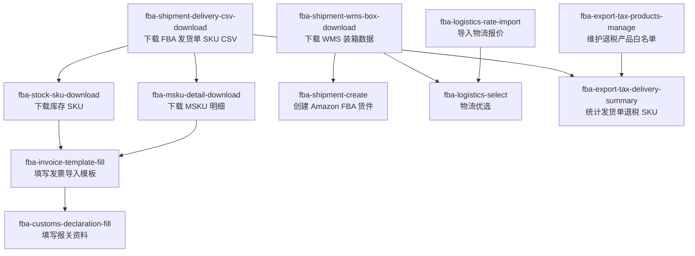

# FBA Workflow Map

Use this skill to explain or route the FBA module. It is a module guide, not an execution skill.

## Skill Map

## Subflows

| Subflow | Skills |
|---|---|
| 发货单数据 | `fba-shipment-delivery-csv-download` |
| 装箱与货件创建 | `fba-shipment-wms-box-download` -> `fba-shipment-create` |
| 发票资料 | `fba-shipment-delivery-csv-download` -> `fba-stock-sku-download` + `fba-msku-detail-download` -> `fba-invoice-template-fill` |
| 报关资料 | Prepared replenishment workbook + local box data -> `fba-customs-declaration-fill` |
| 物流报价与优选 | `fba-logistics-rate-import` for rates, `fba-logistics-select` for choosing a route |
| 出口退税 | `fba-export-tax-products-manage` for whitelist, `fba-export-tax-delivery-summary` for shipment summary |

## Entry Decision Table

| User need | Route to |
|---|---|
| "下载 FBA 发货单 / 发货单 SKU CSV / SP 发货单表格" | `fba-shipment-delivery-csv-download` |
| "下载 WMS 装箱数据 / 托运单 Excel" | `fba-shipment-wms-box-download` |
| "创建 Amazon FBA 货件 / 上传装箱 / 填追踪号" | `fba-shipment-create` |
| "按发货单准备库存 SKU Excel" | `fba-stock-sku-download` |
| "下载 MSKU 明细 / 发票前准备 MSKU 数据" | `fba-msku-detail-download` |
| "填写 invoice_Template / 生成发票导入表" | `fba-invoice-template-fill` |
| "填写报关资料 / 生成报关单发票箱单合同" | `fba-customs-declaration-fill` |
| "导入物流报价 / 更新物流价格" | `fba-logistics-rate-import` |
| "物流优选 / 选物流渠道" | `fba-logistics-select` |
| "维护可退税 SKU 白名单" | `fba-export-tax-products-manage` |
| "统计某个发货单的退税 SKU" | `fba-export-tax-delivery-summary` |

## SP Number Routing

| User only has | Ask or infer |
|---|---|
| `SP...` + asks for FBA 发货单 or SKU CSV | Use `fba-shipment-delivery-csv-download` |
| `SP...` + asks for WMS 装箱 or 托运单 | Use `fba-shipment-wms-box-download` |
| `SP...` + asks for 发票 | Prepare required delivery, stock SKU, and MSKU detail files before `fba-invoice-template-fill` |
| `SP...` + asks for 退税汇总 | Use `fba-export-tax-delivery-summary` |

## Answering Rules

- Explain the relevant subflow first, then name the exact next skill.
- For execution requests, switch to the target business skill instead of running commands from this map.
- Distinguish FBA 发货单 CSV from WMS 装箱 Excel whenever the user only provides an `SP...` number.
