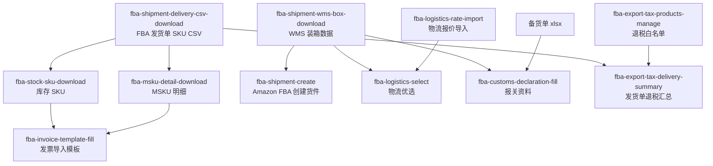

# FBA Workflow Map

本 skill 只负责解释和路由；执行请求必须切到具体业务 skill。

## Terminology

| Term | Meaning | Skill |
|---|---|---|
| FBA 发货单 / 发货单 SKU 数据 / 发货单表格 | 马帮 FBA 发货单导出的 SKU CSV | `fba-shipment-delivery-csv-download` |
| WMS 装箱数据 / 托运单 Excel / 装箱 Excel | 马帮 WMS 托运单装箱数据 | `fba-shipment-wms-box-download` |
| Amazon FBA 创建货件 | 在 Seller Central 上传装箱并推进四阶段流程 | `fba-shipment-create` |

只有 `SP...` 单号但没有说明“发货单”或“装箱/WMS/托运单”时，先追问用途，不要猜。

## Skill Map

## Entry Decision Table

| User need | Route to |
|---|---|
| 下载 FBA 发货单、发货单 SKU CSV、SP 发货单表格 | `fba-shipment-delivery-csv-download` |
| 下载 WMS 装箱数据、托运单 Excel、装箱 Excel | `fba-shipment-wms-box-download` |
| 创建 Amazon FBA 货件、上传装箱、确认承运人、填追踪号 | `fba-shipment-create` |
| 按发货单准备库存 SKU Excel | `fba-stock-sku-download` |
| 下载 MSKU 明细、发票前准备 MSKU 数据 | `fba-msku-detail-download` |
| 填写 invoice_Template、生成发票导入表 | `fba-invoice-template-fill` |
| 填写报关资料、生成报关单/发票/箱单/合同 | `fba-customs-declaration-fill` |
| 导入物流报价、更新物流价格 | `fba-logistics-rate-import` |
| 物流优选、选物流渠道 | `fba-logistics-select` |
| 维护可退税 SKU 白名单 | `fba-export-tax-products-manage` |
| 统计某个发货单的退税 SKU | `fba-export-tax-delivery-summary` |

## Subflows

| Subflow | Skills |
|---|---|
| 发货单数据 | `fba-shipment-delivery-csv-download` |
| 装箱与货件创建 | `fba-shipment-wms-box-download` -> `fba-shipment-create` |
| 发票资料 | `fba-shipment-delivery-csv-download` -> `fba-stock-sku-download` + `fba-msku-detail-download` -> `fba-invoice-template-fill` |
| 报关资料 | 备货单 + 本地 WMS 装箱数据 -> `fba-customs-declaration-fill` |
| 物流报价与优选 | `fba-logistics-rate-import` -> `fba-logistics-select` |
| 出口退税 | `fba-export-tax-products-manage` -> `fba-export-tax-delivery-summary` |

## Answering Rules

- 先说明相关子流程，再指出下一步具体 skill。
- 不从本 skill 运行命令；执行时切到目标业务 skill。
- 用户只给 `SP...` 时，必须区分 FBA 发货单 CSV 和 WMS 装箱 Excel。
