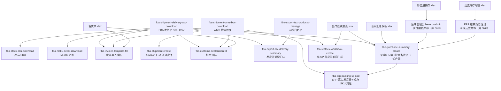

# FBA Workflow Map

本 skill 只负责解释和路由；执行请求必须切到具体业务 skill。

## Terminology

| Term | Meaning | Skill |
|---|---|---|
| FBA 发货单 / 发货单 SKU 数据 / 发货单表格 | 马帮 FBA 发货单导出的 SKU CSV | `fba-shipment-delivery-csv-download` |
| WMS 装箱数据 / 托运单 Excel / 装箱 Excel | 马帮 WMS 托运单装箱数据 | `fba-shipment-wms-box-download` |
| 出口退税总表 | 用户提供的库存 SKU、产品名称、型号、原价、厂家总表 | `fba-purchase-summary-create` / `fba-restock-workbook-create` |
| 期初库存表 / 进销存表 | ERP 上线前人工维护的历史合同、单价和剩余量 | 后端服务器管理员使用 `lxe-erp-admin`（非 Skill） |
| 历史库存增量表 | ERP 上线前合同中因当时缺少装箱数据而未进入期初库存的历史 SP 剩余量 | ERP“结转”页管理员使用“补录历史库存”（非 Skill） |
| 合同汇总模板 | 用户提供的采购合同模板 xlsx，一个 sheet 对应一个公司/厂家 | `fba-purchase-summary-create` |
| Amazon FBA 创建货件 | 在 Seller Central 上传装箱并推进四阶段流程 | `fba-shipment-create` |

只有 `SP...` 单号但没有说明“发货单”或“装箱/WMS/托运单”时，先追问用途，不要猜。

## Skill Map

```mermaid
flowchart TD
  A["fba-shipment-delivery-csv-download<br/>FBA 发货单 SKU CSV"] --> B["fba-stock-sku-download<br/>库存 SKU"]
  A --> C["fba-msku-detail-download<br/>MSKU 明细"]
  A --> D["fba-invoice-template-fill<br/>发票导入模板"]

  E["fba-shipment-wms-box-download<br/>WMS 装箱数据"] --> F["fba-shipment-create<br/>Amazon FBA 创建货件"]
  E --> R["fba-erp-packing-upload<br/>ERP 真实发货量与库存 SKU 对账"]
  E --> D
  L["备货单 xlsx"] --> D
  A --> H["fba-customs-declaration-fill<br/>报关资料"]
  E --> H["fba-customs-declaration-fill<br/>报关资料"]
  L["备货单 xlsx"] --> H

  A --> I["fba-export-tax-delivery-summary<br/>发货单退税汇总"]
  J["fba-export-tax-products-manage<br/>退税白名单"] --> I
  A --> M["fba-purchase-summary-create<br/>采购汇总表+批量备货单+正式合同"]
  N["出口退税总表 xlsx"] --> M
  Q["合同汇总模板 xlsx"] --> M
  X["历史进销存 xlsx"] --> Y["后端管理员 lxe-erp-admin<br/>一次性期初库存（非 Skill）"]
  Y --> M
  Z["历史库存增量 xlsx"] --> W["ERP 结转页管理员<br/>补录历史库存（非 Skill）"]
  W --> M
  M --> R
  A --> O["fba-restock-workbook-create<br/>单 SP 备货单兼容生成"]
  N --> O
```

## Entry Decision Table

| User need | Route to |
|---|---|
| 下载 FBA 发货单、发货单 SKU CSV、SP 发货单表格 | `fba-shipment-delivery-csv-download` |
| 下载 WMS 装箱数据、托运单 Excel、装箱 Excel | `fba-shipment-wms-box-download` |
| 上传真实发货量、同步装箱数据到 ERP、生成装箱对账 | `fba-erp-packing-upload` |
| 将现有进销存表初始化为 ERP 历史库存 | 说明这是部署前的一次性管理操作；由后端服务器管理员执行 `lxe-erp-admin opening-inventory` |
| 补录 ERP 上线前、尚未进入期初库存的历史 SP 剩余库存 | 说明这是 ERP“结转”页的管理员操作；使用“补录历史库存”，不执行 Agent Skill |
| 创建 Amazon FBA 货件、上传装箱、确认承运人、填追踪号 | `fba-shipment-create` |
| 按发货单准备库存 SKU Excel | `fba-stock-sku-download` |
| 下载 MSKU 明细、发票前准备 MSKU 数据 | `fba-msku-detail-download` |
| 填写 invoice_Template、生成发票导入表 | `fba-invoice-template-fill` |
| 填写报关资料、生成报关单/发票/箱单/合同 | `fba-customs-declaration-fill` |
| 按一批发货单、出口退税总表和合同模板生成采购汇总表、批量备货单、正式合同 | `fba-purchase-summary-create` |
| 生成正式采购合同 | `fba-purchase-summary-create`；合同由正式采购流程在本地一并生成，不再单独执行合同 Skill |
| 按 ERP 采购批次号重新生成采购汇总、备货单和正式合同 | `fba-purchase-files-regenerate`；只读取当前有效版本并覆盖生成全部采购文件 |
| 明确只按单个发货单独立生成备货单，且不需要整批正飞均价 | `fba-restock-workbook-create` |
| 维护可退税 SKU 白名单 | `fba-export-tax-products-manage` |
| 统计某个发货单的退税 SKU | `fba-export-tax-delivery-summary` |

## Subflows

| Subflow | Skills |
|---|---|
| 发货单数据 | `fba-shipment-delivery-csv-download` |
| 装箱与货件创建 | `fba-shipment-wms-box-download` -> `ziniao-browser` -> `fba-shipment-create` |
| ERP 真实发货量 | 原始 WMS 装箱文件 -> `fba-erp-packing-upload` -> ERP 按采购批次 MSKU 映射展开库存 SKU 并对账 |
| ERP 期初库存 | 历史进销存 xlsx -> 后端管理员 CLI 预览 -> SHA-256 确认 -> FIFO 库存批次；Agent 不执行 |
| ERP 历史库存补录 | 历史增量 xlsx -> ERP 结转页管理员预览 -> SHA-256 确认 -> FIFO 库存批次；Agent 不执行 |
| 发票资料 | 备货单 + FBA 发货单 CSV + 本地 WMS 装箱数据 -> `fba-invoice-template-fill` |
| 报关资料 | 备货单 + FBA 发货单 CSV + 本地 WMS 装箱数据 -> `fba-customs-declaration-fill` |
| 正式采购文件生成 | 一批 FBA 发货单 CSV + 出口退税总表 + 合同汇总模板 + 毛利率 -> ERP FIFO 确认 -> `fba-purchase-summary-create` 一次生成采购汇总表、批量备货单和正式合同 |
| 正式采购文件重新生成 | ERP 采购批次号 + 本机当前合同模板 -> `fba-purchase-files-regenerate` 只读取得冻结数据并覆盖生成采购汇总、备货单和合同 |
| 单 SP 备货单兼容生成 | 单个 FBA 发货单 CSV + 出口退税总表 + 毛利率 -> `fba-restock-workbook-create` |
| 出口退税 | `fba-export-tax-products-manage` -> `fba-export-tax-delivery-summary` |

日常正式采购流程应走 `fba-purchase-summary-create`，先由 ERP 确认 FIFO 库存抵扣，再由本地一次生成采购汇总表、备货单和正式合同；正飞 `均价` 只按整批 SP 的本次新采购量计算。`fba-restock-workbook-create` 只作为单 SP 备货单兼容入口，旧采购汇总表不再提供单独生成合同的入口。

## Answering Rules

- 先说明相关子流程，再指出下一步具体 skill。
- 不从本 skill 运行命令；执行时切到目标业务 skill。
- 期初库存和历史库存补录都没有业务 Skill：前者只能由后端服务器管理员执行一次性 CLI，后者只能在 ERP“结转”页由管理员预览并确认。
- 用户只给 `SP...` 时，必须区分 FBA 发货单 CSV 和 WMS 装箱 Excel。
