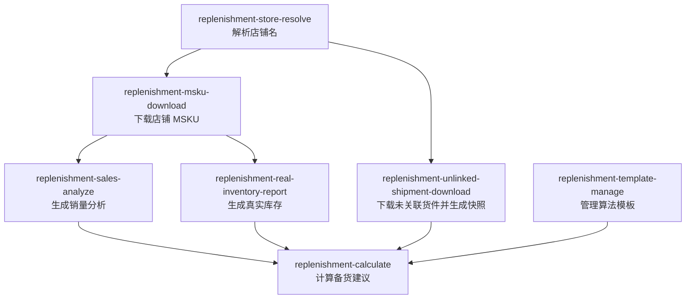

# Replenishment Workflow Map

Use this skill to explain or route the replenishment module. It is a module guide, not an execution skill.

## Skill Map

## Main Flow

| Step | Use this skill | Output used by |
|---|---|---|
| 1 | `replenishment-store-resolve` | Provides standard `store_name`, `store_id`, and `id_type` |
| 2 | `replenishment-msku-download` | Provides local store MSKU workbook |
| 3 | `replenishment-sales-analyze` | Provides sales analysis report for calculation |
| 4 | `replenishment-real-inventory-report` | Provides real inventory report for calculation |
| 5 | `replenishment-unlinked-shipment-download` | Provides same-day unlinked shipment snapshot for optional deduction |
| 6 | `replenishment-calculate` | Generates final replenishment recommendation workbook |

`replenishment-template-manage` is the parameter-side workflow. Use it when the user wants to view, export, validate, import, replace, rename, or choose replenishment algorithm templates.

## Entry Decision Table

| User need | Route to |
|---|---|
| "这个店铺名对吗 / 店铺 ID 是什么 / 店铺名不完整" | `replenishment-store-resolve` |
| "下载店铺 MSKU / 准备备货用 MSKU 数据" | `replenishment-msku-download` |
| "生成销量分析 / 看链接或 ASIN 销量趋势" | `replenishment-sales-analyze` |
| "查真实库存 / 备货前补库存数据" | `replenishment-real-inventory-report` |
| "下载未关联货件 / 生成未关联货件快照" | `replenishment-unlinked-shipment-download` |
| "看算法参数 / 新建或修改模板 / 用哪个模板" | `replenishment-template-manage` |
| "计算备货量 / 生成备货建议 / 链接备货汇总" | `replenishment-calculate` |

## Missing Data Routing

| Symptom | Next skill |
|---|---|
| Store name is fuzzy or not normalized | `replenishment-store-resolve` |
| No local MSKU workbook | `replenishment-msku-download` |
| Missing sales analysis report | `replenishment-sales-analyze` |
| Missing real inventory report | `replenishment-real-inventory-report` |
| Calculation warns that same-day unlinked shipment snapshot is missing | `replenishment-unlinked-shipment-download`, then rerun `replenishment-calculate` |
| User wants a non-default algorithm | `replenishment-template-manage`, then rerun `replenishment-calculate` with that template |

## Answering Rules

- Explain the module relationship first, then name the exact next skill.
- For execution requests, switch to the target business skill instead of running commands from this map.
- Keep references to generated files at the workflow level unless the target skill has already returned concrete paths.
