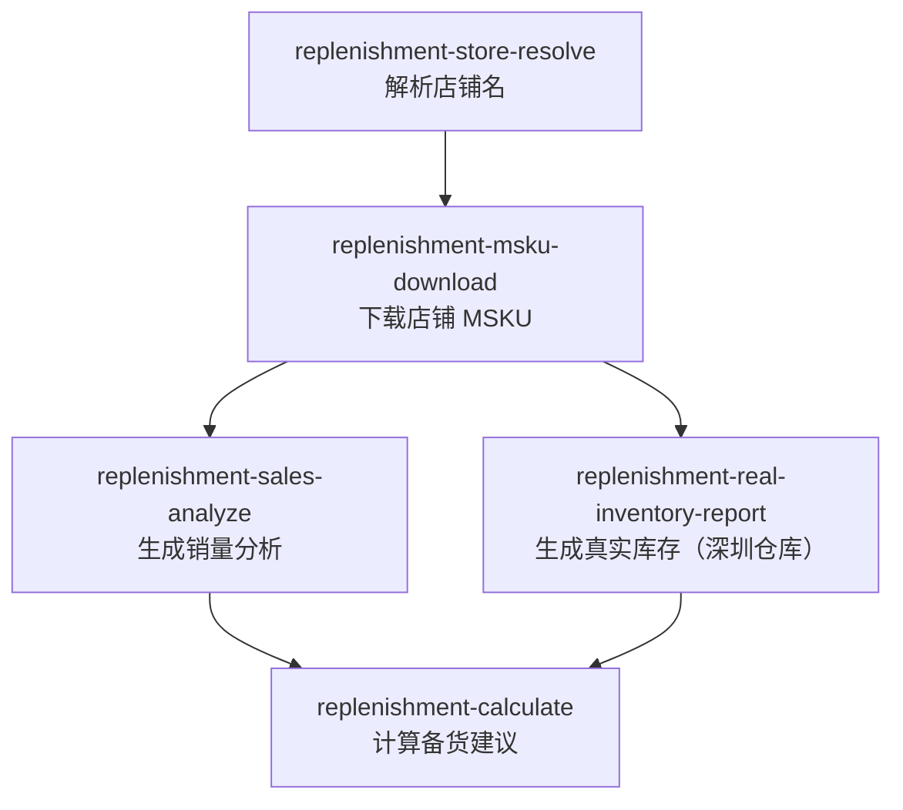
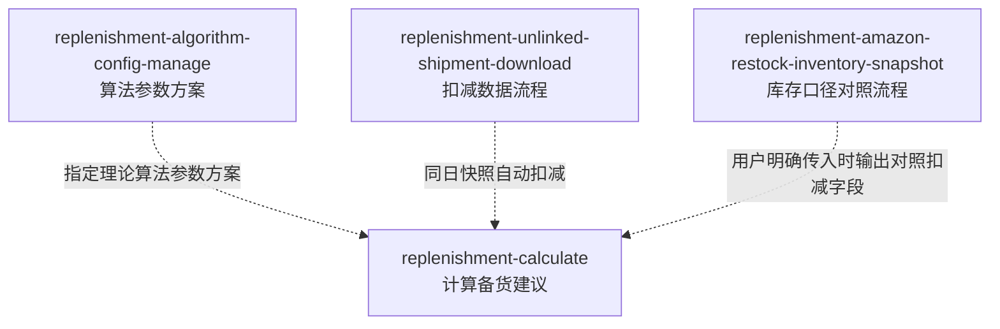

# 备货模块流程导览

这个 skill 只负责解释备货模块流程和路由，不直接执行 CLI。

## 核心流程

## 增强流程

## 主流程

| 步骤 | 使用 skill | 产物 |
|---|---|---|
| 1 | `replenishment-store-resolve` | 规范 `store_name`、`store_id`、`id_type` |
| 2 | `replenishment-msku-download` | 店铺 MSKU 原始数据 |
| 3 | `replenishment-sales-analyze` | 销量分析报告 |
| 4 | `replenishment-real-inventory-report` | 真实库存（深圳仓库）报告 |
| 5 | `replenishment-calculate` | 最终备货建议 workbook |

`replenishment-algorithm-config-manage` 是算法参数方案流程，只管理理论规则，例如日销权重、空运补货天数、空运阈值、海运进入条件、海运补货天数和海运同时空运天数。

库存扣减属于计算阶段：`replenishment-calculate` 会在参数方案结果上扣减马帮 FBA 库存和同日未关联货件。亚马逊补充库存是可选对照输入，不属于参数方案。

增强流程：

| 增强项 | 使用 skill | 对计算的影响 |
|---|---|---|
| 非默认算法参数方案 | `replenishment-algorithm-config-manage` | 用户传 `--template "<参数方案名>"`，改变理论算法规则 |
| 同日未关联货件扣减 | `replenishment-unlinked-shipment-download` | 计算时自动查找同日快照并扣减 |
| 亚马逊补充库存对照字段 | `replenishment-amazon-restock-inventory-snapshot` | 用户传 snapshot 路径后，计算结果增加对照扣减列 |

## 入口判断

| 用户需求 | 路由到 |
|---|---|
| "这个店铺名对吗 / 店铺 ID 是什么 / 店铺名不完整" | `replenishment-store-resolve` |
| "下载店铺 MSKU / 准备备货用 MSKU 数据" | `replenishment-msku-download` |
| "生成销量分析 / 看链接或 ASIN 销量趋势" | `replenishment-sales-analyze` |
| "查真实库存（深圳仓库） / 备货前补库存数据" | `replenishment-real-inventory-report` |
| "下载未关联货件 / 生成未关联货件快照" | `replenishment-unlinked-shipment-download` |
| "解析亚马逊补充库存 CSV / 使用亚马逊补充库存" | `replenishment-amazon-restock-inventory-snapshot` |
| "看算法参数 / 新建或修改参数方案 / 用哪个参数方案" | `replenishment-algorithm-config-manage` |
| "计算备货量 / 生成备货建议 / 链接备货汇总" | `replenishment-calculate` |

## 已有文件判断

| 用户已有内容 | 下一步 |
|---|---|
| 模糊店铺名 | 运行 `replenishment-store-resolve` |
| 规范 `store_name` | 运行 `replenishment-msku-download` |
| 店铺 MSKU 数据 workbook | 运行 `replenishment-sales-analyze` 和 `replenishment-real-inventory-report` |
| 销量分析 + 真实库存（深圳仓库）报告 | 运行 `replenishment-calculate` |
| 未关联货件 raw/snapshot 问题 | 先运行 `replenishment-unlinked-shipment-download`，再重新计算 |
| 亚马逊补充库存 CSV | 运行 `replenishment-amazon-restock-inventory-snapshot`，再把返回的 snapshot 路径传给计算 |
| 备货算法配置表 or 参数调整需求 | 运行 `replenishment-algorithm-config-manage` |

## 缺数据路由

| 现象 | 下一步 |
|---|---|
| 店铺名不完整或不规范 | `replenishment-store-resolve` |
| 没有店铺 MSKU 数据 | `replenishment-msku-download` |
| 缺少销量分析报告 | `replenishment-sales-analyze` |
| 缺少真实库存（深圳仓库）报告 | `replenishment-real-inventory-report` |
| 计算提醒缺少同日未关联货件快照 | `replenishment-unlinked-shipment-download`，然后重新运行 `replenishment-calculate` |
| 用户要亚马逊补充库存扣减字段 | `replenishment-amazon-restock-inventory-snapshot`，然后带 snapshot 路径重新运行 `replenishment-calculate` |
| 用户要非默认算法 | `replenishment-algorithm-config-manage`，然后带参数方案重新运行 `replenishment-calculate` |

## 回复规则

- 先解释模块关系，再给出准确的下一个 skill。
- 遇到执行请求时，切换到目标业务 skill，不在导览 skill 里直接跑命令。
- 除非目标 skill 已经返回具体路径，否则只描述流程级文件关系。
