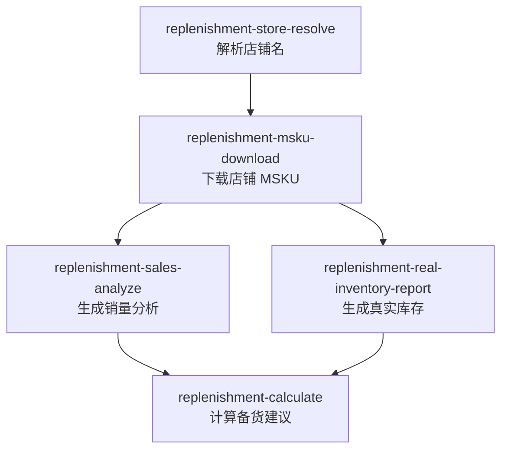
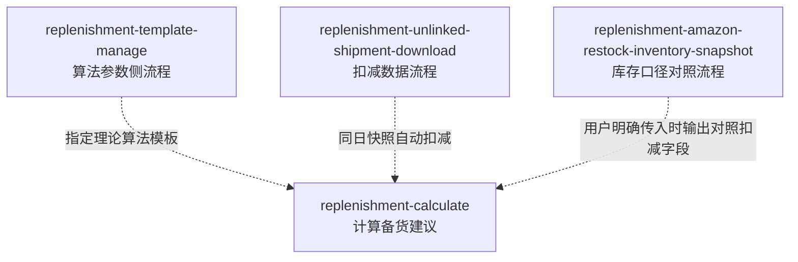

# Replenishment Workflow Map

Use this skill to explain or route the replenishment module. It is a module guide, not an execution skill.

## Core Flow

## Optional Enhancements

## Main Flow

| Step | Use this skill | Output used by |
|---|---|---|
| 1 | `replenishment-store-resolve` | Provides standard `store_name`, `store_id`, and `id_type` |
| 2 | `replenishment-msku-download` | Provides local store MSKU workbook |
| 3 | `replenishment-sales-analyze` | Provides sales analysis report for calculation |
| 4 | `replenishment-real-inventory-report` | Provides real inventory report for calculation |
| 5 | `replenishment-calculate` | Generates final replenishment recommendation workbook |

`replenishment-template-manage` is the algorithm-parameter workflow. It only manages theoretical rules such as daily-sales weights, replenishment days, air thresholds, sea entry conditions, sea days, and companion-air days.

Inventory deductions are calculation-side logic: `replenishment-calculate` deducts Mabang FBA inventory and same-day unlinked shipments from the template result. Amazon restock inventory is an optional comparison input, not a template parameter.

Optional enhancements:

| Enhancement | Use this skill | How it affects calculation |
|---|---|---|
| Non-default algorithm template | `replenishment-template-manage` | User passes `--template "<模板名>"`; this changes theoretical algorithm rules |
| Same-day unlinked shipment deduction | `replenishment-unlinked-shipment-download` | Calculation auto-detects same-day snapshot and deducts it |
| Amazon restock inventory comparison fields | `replenishment-amazon-restock-inventory-snapshot` | User passes snapshot path to calculation for optional comparison columns |

## Entry Decision Table

| User need | Route to |
|---|---|
| "这个店铺名对吗 / 店铺 ID 是什么 / 店铺名不完整" | `replenishment-store-resolve` |
| "下载店铺 MSKU / 准备备货用 MSKU 数据" | `replenishment-msku-download` |
| "生成销量分析 / 看链接或 ASIN 销量趋势" | `replenishment-sales-analyze` |
| "查真实库存 / 备货前补库存数据" | `replenishment-real-inventory-report` |
| "下载未关联货件 / 生成未关联货件快照" | `replenishment-unlinked-shipment-download` |
| "解析亚马逊补充库存 CSV / 使用亚马逊补充库存" | `replenishment-amazon-restock-inventory-snapshot` |
| "看算法参数 / 新建或修改模板 / 用哪个模板" | `replenishment-template-manage` |
| "计算备货量 / 生成备货建议 / 链接备货汇总" | `replenishment-calculate` |

## File-In-Hand Decision Table

| User already has | Next step |
|---|---|
| Only a fuzzy store name | Run `replenishment-store-resolve` |
| Standard `store_name` only | Run `replenishment-msku-download` |
| 店铺MSKU数据 workbook | Run `replenishment-sales-analyze` and `replenishment-real-inventory-report` |
| 销量分析 + 真实库存 reports | Run `replenishment-calculate` |
| 未关联货件 raw/snapshot question | Run `replenishment-unlinked-shipment-download` before rerunning calculation |
| 亚马逊补充库存 CSV | Run `replenishment-amazon-restock-inventory-snapshot`, then calculation with the returned snapshot path |
| 模板 xlsx or 参数调整需求 | Run `replenishment-template-manage` |

## Missing Data Routing

| Symptom | Next skill |
|---|---|
| Store name is fuzzy or not normalized | `replenishment-store-resolve` |
| No local MSKU workbook | `replenishment-msku-download` |
| Missing sales analysis report | `replenishment-sales-analyze` |
| Missing real inventory report | `replenishment-real-inventory-report` |
| Calculation warns that same-day unlinked shipment snapshot is missing | `replenishment-unlinked-shipment-download`, then rerun `replenishment-calculate` |
| User wants Amazon restock inventory deduction fields | `replenishment-amazon-restock-inventory-snapshot`, then rerun `replenishment-calculate` with the snapshot path |
| User wants a non-default algorithm | `replenishment-template-manage`, then rerun `replenishment-calculate` with that template |

## Answering Rules

- Explain the module relationship first, then name the exact next skill.
- For execution requests, switch to the target business skill instead of running commands from this map.
- Keep references to generated files at the workflow level unless the target skill has already returned concrete paths.
